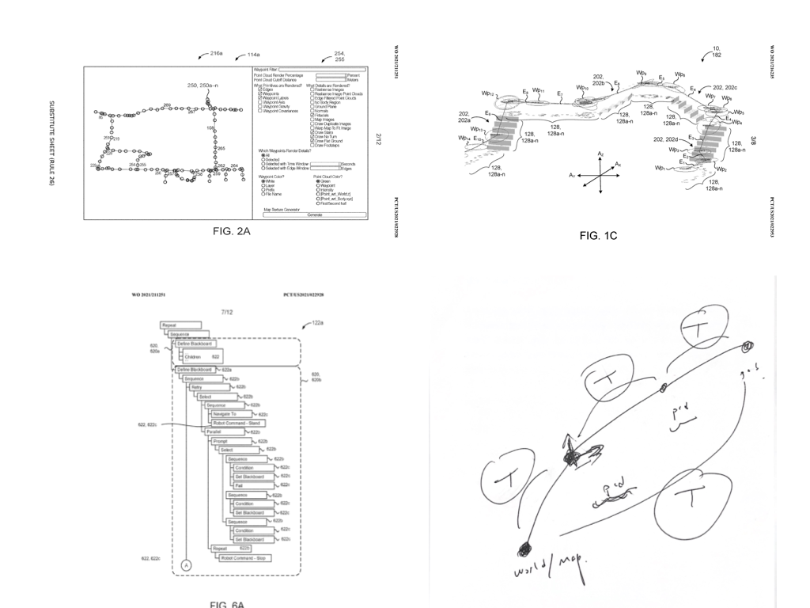

# ROS安装包

## 基本概念

- Debian
- Ubuntu
- apt (Advanced Packaging Tool) 软件包管理器
  - 自动下载，配置，安装二进制或者源代码格式的软件包。最早被设计成dpkg的前端，用来处理deb格式的软件包。
  - Ref: [APT HOWTO](https://www.debian.org/doc/manuals/apt-howto/index.zh-cn.html#contents)
- rosdep: A command-line tool for installing system dependencies.
- ROS **package** vs **workspace** (install)

## 本地生成ROS安装包文件

```bash
$ sudo apt-get install python-bloom
$ cd path/to/your/catkin/package
$ bloom-generate rosdebian
$ fakeroot debian/rules binary
```

## GitHub CI 自动生成安装包

<p align="center">
  
</p>

[](https://github.com/matheecs/matheecs.github.io/actions/workflows/pages/pages-build-deployment)

```yaml
# This is a basic workflow to help you get started with Actions

name: CI

# Controls when the workflow will run
on:
  # Triggers the workflow on push or pull request events but only for the "master" branch
  push:
    branches: [ "master" ]
  pull_request:
    branches: [ "master" ]

  # Allows you to run this workflow manually from the Actions tab
  workflow_dispatch:

# A workflow run is made up of one or more jobs that can run sequentially or in parallel
jobs:
  # This workflow contains a single job called "build"
  build:
    # The type of runner that the job will run on
    runs-on: ubuntu-latest

    # Steps represent a sequence of tasks that will be executed as part of the job
    steps:
      # Checks-out your repository under $GITHUB_WORKSPACE, so your job can access it
      - uses: actions/checkout@v3

      # Runs a single command using the runners shell
      - name: Run a one-line script
        run: echo Hello, world!

      - uses: ros-tooling/setup-ros@v0.2
        with:
          required-ros-distributions: noetic

      - uses: gdut-dynamic-x/ros-build-deb-action@v1
        with:
          ros_distro: noetic
          timestamp: true

      - name: Get artifact
        uses: actions/upload-artifact@v3
        with:
          name: artifact
          path: |
              *.deb
              *.ddeb
```

Ref

1. [了解 GitHub Actions](https://docs.github.com/cn/actions/learn-github-actions/understanding-github-actions)
2. [ros-build-deb-action](https://github.com/gdut-dynamic-x/ros-build-deb-action)

Note: **CPack** 用于 CMake 工程打包。

## Class + ROS Interface 解耦开发

ROS as API

# 循迹导航框架

References: ETH + Spot

## Teach & Repeat Framework

1. State Estimation
   1. 拓扑地图
   2. 局部定位 (ICP) & 局部地图
   3. 视觉结合激光
2. Perception
   1. 地形图
   2. 凸多边形区域
   3. 可通行区域
   4. SDF
3. Planning & Control
   1. HPIPM
   2. OCS2
   3. **QP & Sequential Composition**


