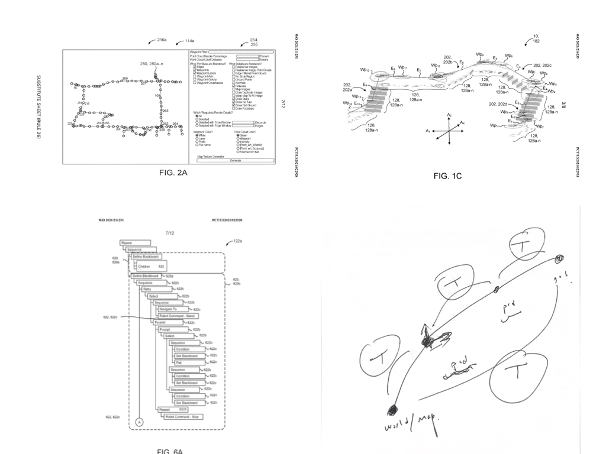

## Teach & Repeat Framework

1. State Estimation
   1. 拓扑地图
   2. 局部定位 (ICP) & 局部地图
   3. 视觉结合激光
2. Perception
   1. 地形图
   2. 凸多边形区域
   3. 可通行区域
   4. SDF
3. Planning & Control
   1. HPIPM
   2. OCS2
   3. **QP & Sequential Composition**

## GUI

Functions

- 增删查改 waypoints + edges
- 直观可选 point cloud + waypoints + edges
- 交互界面 ImGui
- 导入地图与里程计 (from ROS)
- 保存，导出JSON文件 waypoints + edges
- 搜索最近点与最短路径 (to ROS)

Note: 显示彩色透明点云地图，考虑地图降采样
