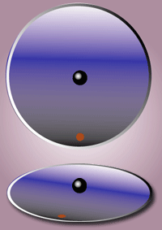

$$
\mathbf{a}=\mathbf{a}_{I}-2 \boldsymbol{\omega} \times \mathbf{v}-\dot{\boldsymbol{\omega}} \times \mathbf{r}-\boldsymbol{\omega} \times(\boldsymbol{\omega} \times \mathbf{r})
$$

**在旋转坐标系下观察**，运动的物体（运动方向和旋转轴不为同一个轴时）会受到**科氏力**的作用。

Transport Theorem：
$$
\frac{\mathrm{d}}{\mathrm{d} t} \boldsymbol{f}=\left[\left(\frac{\mathrm{d}}{\mathrm{d} t}\right)_{r}+\boldsymbol{\Omega} \times\right] \boldsymbol{f}
$$
[Rotating reference frame](https://en.wikipedia.org/wiki/Rotating_reference_frame)

[Visualization of the Coriolis and centrifugal forces](https://www.youtube.com/watch?v=49JwbrXcPjc)
$$
\mathbf{v}_{\mathbf{i}} \stackrel{\mathrm{def}}{=} \frac{\mathrm{d} \mathbf{r}}{\mathrm{d} t}=\left(\frac{\mathrm{d} \mathbf{r}}{\mathrm{d} t}\right)_{\mathrm{r}}+\mathbf{\Omega} \times \mathbf{r}=\mathbf{v}_{\mathrm{r}}+\mathbf{\Omega} \times \mathbf{r}
$$
where subscript *i* means the inertial frame of reference, and *r* means the rotating frame of reference.
$$
\mathbf{a}_{\mathrm{r}}=\mathbf{a}_{\mathrm{i}}-2 \boldsymbol{\Omega} \times \mathbf{v}_{\mathrm{r}}-\boldsymbol{\Omega} \times(\boldsymbol{\Omega} \times \mathbf{r})-\frac{\mathrm{d} \boldsymbol{\Omega}}{\mathrm{d} t} \times \mathbf{r}
$$
