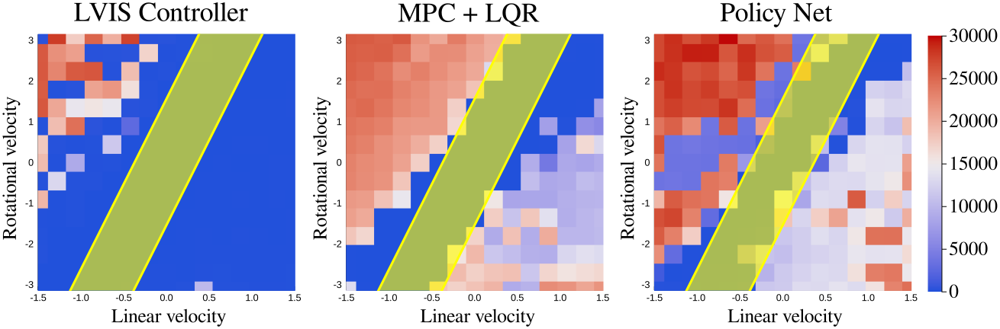
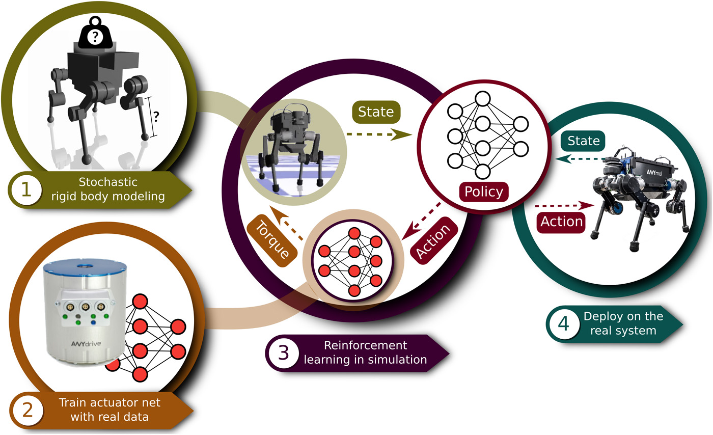
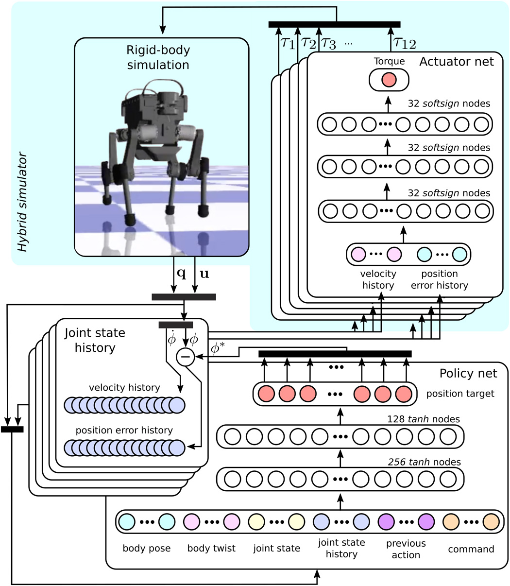
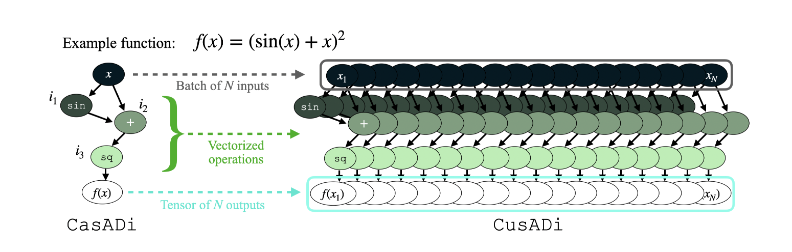
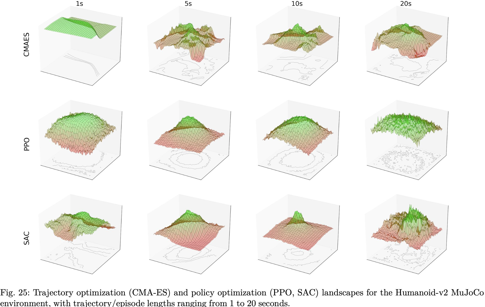
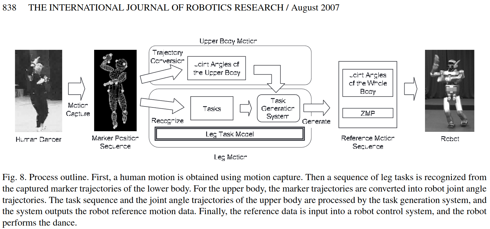
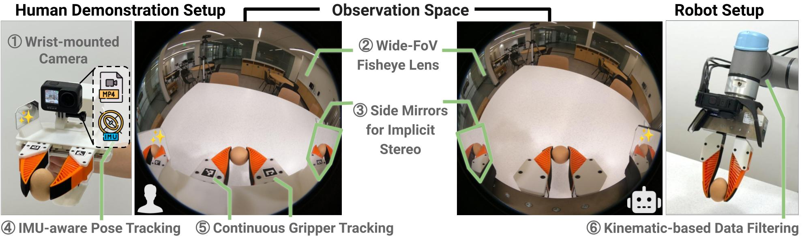

### Paper reading

* [LVIS](https://github.com/rdeits/LVIS-dev): Learning from Value Interval Sampling (Offline + Online)

  

* *Learning agile and dynamic motor skills for legged robots*: 作者 Hwangbo 同时开发了 RaiSim 仿真器和 RL 框架 👍👍👍

  
  

* CusADi

  

* [Whole-Body MPC](https://www.youtube.com/watch?v=Xmi7AFGhlFc)

  

  * Related: [Aligator](https://github.com/Simple-Robotics/aligator), [Crocoddyl](https://github.com/loco-3d/crocoddyl)
  * Tricks:
    * tailor the solution accuracy to the computational budget by running a small but **fixed number of iterations** at high rates
    * CBF constraints at the first timestep for self-collision avoidance: $\boldsymbol{J}_{\boldsymbol{h}} \dot{\boldsymbol{v}}+\dot{\boldsymbol{J}}_{\boldsymbol{h}} \dot{\boldsymbol{q}}+\left(\alpha_1+\alpha_2\right) \boldsymbol{J}_{\boldsymbol{h}} \dot{\boldsymbol{q}}+\left(\alpha_1 \alpha_2\right) \boldsymbol{h}(\boldsymbol{q}) \geq \mathbf{0}$
    * ADMM(OSQP)
    * warm-start
    * inverse dynamics (RNEA) but ~~FD~~
    * keeps structure of the QP **fixed**
    * The constraints and derivatives are computed using **CasADi**’s AD and codegeneration

* [Visualizing Movement Control Optimization Landscapes](https://arxiv.org/abs/1909.07869)

  

* Learning from Observation Paradigm: Leg Task Models for Enabling a Biped Humanoid Robot to Imitate Human Dances

  

* [Design and Control of a Bipedal Robotic Character](https://la.disneyresearch.com/publication/design-and-control-of-a-bipedal-robotic-character/)

  

* [Interactive Design of Stylized Walking Gaits for Robotic Characters](https://la.disneyresearch.com/publication/interactive-design-of-stylized-walking-gaits-for-robotic-characters/)
  
  

* [Russ Tedrake: Planning with Graphs of Convex Sets (in the age of foundation models)](https://www.youtube.com/watch?v=JZokn4Pc-YY)
* [Siyuan Feng & Ben Burchfiel: Towards Large Behavior Models](https://www.youtube.com/watch?v=fwBbj6UmK-I&t=3742s)
* [Orbit: A Unified Simulation Framework for Interactive Robot Learning Environments](https://isaac-orbit.github.io/)

  

* [Universal Manipulation Interface](https://umi-gripper.github.io)

  

  * GoPro as the only sensor and recording device.
  * Note the physical side mirrors highlighted in green which provide implicit stereo information.
  * Latency Measurement.
  * We use Diffusion Policy for all tasks.

* [Learning to Fly in Seconds](https://github.com/arplaboratory/learning-to-fly)
* [RLtools (~acados)](https://github.com/rl-tools/rl-tools)
* [GRiD: GPU-Accelerated Rigid Body Dynamics = URDFParser + GRiDCodeGenerator + RBDReference](https://brianplancher.com/publication/grid/)
* [MPCGPU: NMPC through PCG on GPU](https://arxiv.org/pdf/2309.08079.pdf)
* [TinyMPC](https://github.com/TinyMPC/TinyMPC)
* [Efficient Trajectory Optimization for Robot Motion Planning (**CasADi + Chebfun**)](https://arxiv.org/pdf/1810.04255.pdf)
* [Efficient Tactile Simulation with Differentiability for Robotic Manipulation](https://openreview.net/pdf?id=6BIffCl6gsM)
  * [Tactile-Based Control Environments](https://github.com/eanswer/TactileSimulation)
  * [DiffRedMax](https://github.com/eanswer/DiffHand)
  * [RedMax: efficient & flexible approach for articulated dynamics](https://dl.acm.org/doi/10.1145/3306346.3322952)
  * [GelSlim 3.0](https://github.com/mcubelab/gelslim)
* [TRI’s Robots Learn New Manipulation Skills in an Afternoon. Here’s How.](https://medium.com/toyotaresearch/tris-robots-learn-new-skills-in-an-afternoon-here-s-how-2c30b1a8c573)

  

* [Meet Punyo, TRI’s Soft Robot for Whole-Body Manipulation Research](https://medium.com/toyotaresearch/meet-punyo-tris-soft-robot-for-whole-body-manipulation-research-949c934ac3d8)
  * [Punyo-1: Soft tactile-sensing upper-body robot for large object manipulation and physical HRI](https://arxiv.org/pdf/2111.09354.pdf)

    > Exploiting mechanical intelligence often leads to [simplifications in the control strategy](https://www.youtube.com/watch?v=WNXSAK6pF0M&t=72s) for intelligent systems.

  > If a policy works in Drake, it typically works in the real world.
  

* [Disney’s Newest Robot Demonstrates Collaborative Cuteness](https://spectrum.ieee.org/disney-robot-2666681104)

  

* [Build systems à la carte](https://dl.acm.org/doi/10.1145/3236774)

------

### 编程与实践

* [Crafting Interpreters](https://craftinginterpreters.com/)
* 大话数据结构
* 大话设计模式
* Head First 设计模式
* 深入浅出面向对象分析与设计
* 多型與虛擬——学C++务必读侯捷老师的书
* ~~Linux多线程服务端编程~~
* ~~鳥哥的 Linux 私房菜~~
* C++程序设计：原理与实践
* 一站式学习C编程
* C++ Primer
* Effective C++
* [More Effective C++（中文版） : 35个改善编程与设计的有效方法](https://book.douban.com/subject/5908727/)
* [Effective Modern C++ 简体中文版 : 42招独家技巧助您改善C++11和C++14的高效用法](https://book.douban.com/subject/30178902/)
* [Effective STL中文版 : 50条有效使用STL的经验](https://book.douban.com/subject/1792179/)
* C++标准库
* ~~C++必知必会~~
* ~~Algorithms, data structures, and problem solving with C++~~
* 统计学习方法
* [C++ API设计](https://book.douban.com/subject/24869855/)
* 程序员的自我修养：链接、装载与库
* STL源码剖析
* UNIX环境高级编程
* 计算机程序的构造和解释
* ⭐️深入理解计算机系统
* 算法导论
* ⭐️操作系统导论
* [**Algorithms, 4th Edition**](https://algs4.cs.princeton.edu/home/)
* 数据结构与算法之美（王争）
* [**labuladong的算法小抄**](https://labuladong.gitbook.io/algo/)
* 设计模式之美（王争）
* 趣谈网络协议（刘超）
* [Linkers and Loaders](https://book.douban.com/subject/1436811/)
* 程序员面试白皮书
* 剑指Offer
* C语言接口与实现
* Linux内核源代码情景分析
* Orange'S: 一个操作系统的实现
* [现代 C++ 教程: 高速上手 C++ 11/14/17/20](https://changkun.de/modern-cpp/)
* [每位程式設計師都該知道的記憶體知識](https://jason2506.gitbooks.io/cpumemory/content/)
* Mac OS X Internals
* Masters of Doom (DOOM 启世录)
* 游戏编程精粹

### 机器人感知

* Learning OpenCV 3
* ⭐️视觉SLAM十四讲
* ⭐️由2维影像建立3维模型（写真から作る3次元CG）
* 机器人感知
* ~~增强现实：原理、算法与应用~~
* ~~Course on SLAM~~
* Sensors for Mobile Robots
* Handbook of Modern Sensors
* Computer Vision: A Modern Approach
* Computer Vision: Algorithms and Applications
* **Multiple View Geometry in Computer Vision**
* ~~视觉计算基础：计算机视觉、图形学和图像处理的核心概念~~
* An Invitation to 3-D Vision: From Images to Geometric Models
* Computer Vision: Models, Learning, and Inference
* Pattern Recognition and Machine Learning
* Deep Learning
* 流体动画的计算艺术
* Geometric Data Structures for Computer Graphics
* [Introduction to Computing with Geometry Notes](https://pages.mtu.edu/~shene/COURSES/cs3621/NOTES/)

### 数学与控制

* [重修线性代数](http://blog.sciencenet.cn/blog-826653-1032025.html)
* [重修微积分](http://blog.sciencenet.cn/blog-826653-863396.html)
* Linear Algebra Done Right
* ⭐️**Linear Algebra and Learning from Data**
* Matrix Analysis & Applied Linear Algebra
* Matrix Algebra: Theory, Computations and Applications in Statistics
* ⭐️点集拓扑与代数拓扑引论
* ⭐️陶哲轩实分析
* 凸优化
* 数值最优化方法
* ~~数学简史~~
* Matrix Analysis and Applied Linear Algebra
* ⭐️How to Solve It
* ~~矩阵代数、控制与博弈~~
* 系统与控制中的近代数学基础
* ⭐️线性代数应该这样学
* 高斯经典文章及相关数学工作汇编
* [**Coding The Matrix**: Linear Algebra Through Computer Science Applications](http://codingthematrix.com/)
* Liner Multivariable Control — A Geometric Approach
* [研究之美](https://book.douban.com/subject/7064456/)
* ⭐️Stochastic Models, Estimation and Control
* ⭐️**State Estimation for Robotics**
* Applied Optimal Control
* Stochastic Models, Information Theory, and Lie Groups
* ⭐️数学家的眼光
* [**数学欣赏**](https://book.douban.com/subject/27104313/)
  * Enjoyment of Mathematics
* ⭐️**Nonlinear Dynamics and Chaos**
* [Nonlinear Systems](https://book.douban.com/subject/1574019/)
* [**The Theoretical Minimum**](https://theoreticalminimum.com/)
  * [中文版：理论物理极础](https://www.cnblogs.com/joyfulphysics/category/702893.html)
* [**Quantum Mechanics**](https://book.douban.com/subject/25821853/)
* [**Special Relativity and Classical Field Theory**](https://book.douban.com/subject/27154898/)
* [**力学讲义**](https://book.douban.com/subject/30255619/)
* 经典力学的数学方法
* 半转翼飞行
* Springer **Handbook of Robotics** + **Encyclopedia of Robotics**
* [3D Math Primer for Graphics and Game Development](https://gamemath.com/)

### 机器人规控

* Behavior-Based Robotics
* How the Body Shapes the Way We Think
* The Robotics Primer
* ⭐️A Mathematical Introduction to Robotic Manipulation
* **Probabilistic Robotics**
* ⭐️Robot Programming : A Practical Guide to Behavior-Based Robotics
* Mobile Robots Inspiration to Implementation
* Robotic Explorations
* ROS机器人开发实践
* 机器人建模和控制
* 机器人学：建模、规划与控制
* 多旋翼飞行器设计与控制
* ~~Perceptrons~~
* ⭐️**Legged Robots That Balance**
* ⭐️[**Underactuated Robotics**](http://underactuated.csail.mit.edu/underactuated.html)
* ⭐️**Introduction to Autonomous Mobile Robots**
  * [自主移动机器人ZJU](https://www.bilibili.com/video/av69577101)
* ⭐️机器人学中的状态估计
* [PyTorch深度学习入门](https://book.douban.com/subject/34858119/)
* [DK遇见未来：机器人](https://book.douban.com/subject/30365193/)
* **GEB**: 哥德尔、艾舍尔、巴赫
* Introduction to AI Robotics
* Rigid Body Dynamics Algorithms

### 工程与教育

* **Design Concepts For Engineers**
* 技术的本质
* ⭐️复杂（Complexity: A Guided Tour）
* 伯克利札记
* 游学波士顿
* 大学之路——赠给高中毕业生最好的礼物
* **浪潮之巅**
* 硅谷之谜
* **How to Solve It**——教育是一门艺术
* ⭐️**编码**——Petzold大佬讲计算的实现
* ⭐️[网络是怎样连接的](https://book.douban.com/subject/26941639/)
  > 如果只是讲解 TCP/IP、以太网这些单独的技术，读者就无法理解网络这个系统的全貌；如果无法理解网络的全貌，也就无法理解每一种网络技术背后的本质意义；而如果无法理解其本质意义，就只能停留在死记硬背的程度，无法做到实际应用。
* 程序是怎样跑起来的
* 计算机是怎样跑起来的
* [图灵的秘密](https://book.douban.com/subject/10779604/)——Petzold大佬讲计算的本质
* 人工智能真的来了
* 晨曦集
* Surely You're Joking, Mr. Feynman
* The Idea Factory: Learning to Think at MIT
* **Whiplash**: How to Survive Our Faster Future
* ⭐️The Sorcerers and Their Apprentices
* 像外行一样思考，像专家一样实践
* 芝加哥大学论文写作指南
* 流体动画的计算艺术
* [Just for Fun](https://book.douban.com/subject/1451172/)
* [The Character of Physical Law](https://book.douban.com/subject/2880875/)
* [思考的孩子](https://book.douban.com/subject/35038244/)

### 生活与哲学

* **原则**
* [**Grit : The Power of Passion and Perseverance**](https://book.douban.com/subject/26664265/)
* 哲学 科学 常识
* 忏悔录
* **社会契约论**
  * 人民 → 人民代表大会 → 人民政府、监督委员会、人民法院、人民检察院
* ⭐️从卢梭到尼采
* 医本正经——用中医的思维看生活
* 如果舌尖能思考
* 新教伦理与资本主义精神
* 小顾聊绘画
* ⭐️查拉图斯特拉如是说
* 人生智慧录
* **人生智慧箴言**
* [叔本华与梵•高：箴言与绘画](https://book.douban.com/subject/30278635/)
* [梵高手稿](https://book.douban.com/subject/26666533/)
* 生存空虚说
* 大问题：简明哲学导论
* 文心
* 超简单的乐理学习图解版
* 我们仨
* 文化苦旅
* 百年孤独
* 目送
* 万年的竞争
* 给青年编剧的信
* 万历十五年
* [生命是什么](https://book.douban.com/subject/30263244/)
* [生命是什么 : 40亿年生命史诗的开端](https://book.douban.com/subject/30219714/)
* [学术与政治](https://book.douban.com/subject/30423925/)
* [最好的告别 : 关于衰老与死亡，你必须知道的常识](https://book.douban.com/subject/26576861/)
* [褚时健 : 影响企业家的企业家](https://book.douban.com/subject/26220259/)
* [医学就会](https://book.douban.com/subject/30176310/)
* [**医目了然**：家庭常见病中成药使用指南](https://book.douban.com/subject/33379178/)
* [**薄世宁医学通识讲义**](https://book.douban.com/subject/34842793/)
* 寻美记
* ~~逻辑哲学论~~
* 科学与宗教的领地
* [FLATLAND](http://wordyenglish.com/flatland/index.html)
* [神奇的二维国](http://wordyenglish.com/flatland_chinese/flatland_chinese_index.html)
* 世界美术名作二十讲
* **侘寂**
* 2001太空漫游
* 三体
* 佛祖在一号线
* 捍卫隐私
* 线上幽灵
* 反叛的科学家
* 日日之食

### 艺术与设计

* ⭐️写给大家看的设计书
  * Contrast
  * Repetition
  * Alignment
  * Proximity
* 启示录
* 结网
* 产品思维30讲（梁宁）
* 透视如此简单 = Perspective Made Easy
* Successful Drawing
* ⭐️Sketching : The Basics
* Presentation Zen : Simple Ideas on Presentation Design and Delivery
* [30天学会绘画](https://book.douban.com/subject/20387173/)
* [小顾聊神话](https://book.douban.com/subject/26865730/)
* [Beautiful Symmetry](http://www.beautifulsymmetry.onl/)
  * [This is a Coloring Book about Group Theory](https://github.com/aberke/coloring-book)
* [破立](https://book.douban.com/subject/26930286/)
* 程序员修炼之道：通向务实的最高境界
* 硅谷革命：成就苹果公司的疯狂往事
* ⭐️设计心理学 4 = The Design of Future Things
* ⭐️霍克尼论摄影

### 商业与管理

* 小狗钱钱——自信、目标、爱好
* **富爸爸穷爸爸**
* 乡土中国
* [中国国家治理的制度逻辑](https://web.stanford.edu/~xgzhou/zhou_book2017.pdf)
* 政治学通识
* **明朝那些事儿**
* **影响力**
* **新概念英语4**
* **Whiplash**（中文版：爆裂）
  * 涌现优于权威
  * 拉力优于推力
  * 罗盘优于地图
  * 风险优于安全
  * 违抗优于服从
  * 实践优于理论
  * 多元优于能力
  * 韧性优于力量
  * 系统优于个体

### 电影与电视

* 我们与恶的距离
* 飞屋环游记
* 寻梦环游记
* **心灵捕手**
* **死亡诗社**
* **放牛班的春天**
* 黑暗骑士
* 黑客帝国
* 2001太空漫游
* 盗梦特攻队
* 至爱梵高
* 大闹天宫
* 大话西游之大圣娶亲
* 天空之城
* 背靠背，脸对脸
* [Ruben Brandt, Collector](http://rubenbrandt.com/)
* [Fast, Cheap & Out of Control](https://www.bilibili.com/video/av24048520)
* 一一
* 父亲三部曲：推手 & 喜宴 & 饮食男女
* 八两金
* 活着
* 国王的演讲 & 至暗时刻 & 敦刻尔克
* [Whiplash](https://movie.douban.com/subject/25773932/)
* 梦华录
* 我们与恶的距离 = The World Between Us
* 风犬少年的天空
* 武林外传
* 爱情公寓
* 仙剑奇侠传
* 白蛇传·情
* 老友记

### 走过的书店

* 西安｜曲江书城
* 南京｜先锋书店
* 北京｜万圣书园
* 杭州｜博库书城
