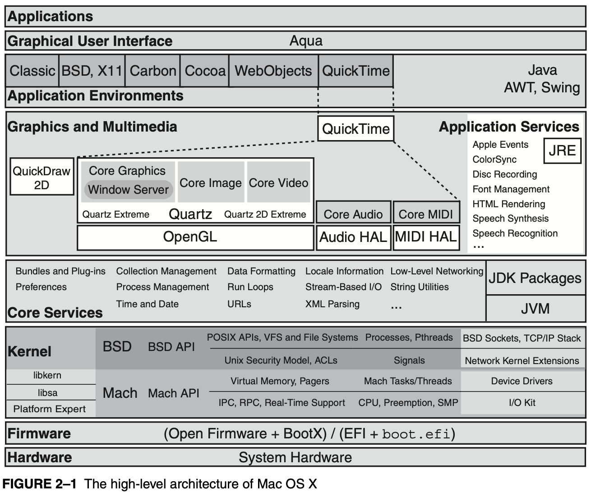

### 参数取值范围错误

原文链接 [一起做RGB-D SLAM (3)](http://www.cnblogs.com/gaoxiang12/p/4659805.html)

使用 CLion，强烈推荐，比 Qt Creator 好用。调试终止在 solvePnPRansac 函数：

```bash
OpenCV Error: Assertion failed (confidence > 0 && confidence < 1) in run, file /Users/zhangjixiang/Downloads/opencv-3.3.1/modules/calib3d/src/ptsetreg.cpp, line 178`
`libc++abi.dylib: terminating with uncaught exception of type cv::Exception: /Users/zhangjixiang/Downloads/opencv-3.3.1/modules/calib3d/src/ptsetreg.cpp:178: error: (-215) confidence > 0 && confidence < 1 in function run
```

程序源码：

```c++
cv::solvePnPRansac( pts_obj, pts_img, cameraMatrix, cv::Mat(), rvec, tvec, false, 100, 1.0, 100, inliers );
```

错误原因：参数 confidence 超出了 (0, 1) 范围。

程序改为：

```c++
cv::solvePnPRansac( pts_obj, pts_img, cameraMatrix, cv::Mat(), rvec, tvec, false, 100, 1.0, 0.99, inliers );
```

可正常运行。

### 多余的括号

Bug来源：多余的括号

```c++
string value = str.substr((pos+1, str.length()));
```

运行时错误：

```text
OpenCV Error: Assertion failed (npoints >= 4 && npoints == std::max(ipoints.checkVector(2, 5), ipoints.checkVector(2, 6))) in solvePnPRansac, file /Users/zhangjixiang/Downloads/opencv-3.3.1/modules/calib3d/src/solvepnp.cpp, line 252
libc++abi.dylib: terminating with uncaught exception of type cv::Exception: /Users/zhangjixiang/Downloads/opencv-3.3.1/modules/calib3d/src/solvepnp.cpp:252: error: (-215) npoints >= 4 && npoints == std::max(ipoints.checkVector(2, 5), ipoints.checkVector(2, 6)) in function solvePnPRansac
```

程序可修改为：

```c++
string value = str.substr(pos+1, str.length());
```

### macOS 线程与 UI

导致异常的代码：

```c++
pcl::visualization::CloudViewer viewer("viewer");
viewer.showCloud(output);
while(!viewer.wasStopped())
{

}
```

运行时出错提示：

```text
2018-01-31 19:30:31.598 joinPointCloud[57826:4712504] *** Assertion failure in +[NSUndoManager _endTopLevelGroupings], /BuildRoot/Library/Caches/com.apple.xbs/Sources/Foundation/Foundation-1450.16/Foundation/Misc.subproj/NSUndoManager.m:361
2018-01-31 19:30:31.599 joinPointCloud[57826:4712504] *** Terminating app due to uncaught exception 'NSInternalInconsistencyException', reason: '+[NSUndoManager(NSInternal) _endTopLevelGroupings] is only safe to invoke on the main thread.'
*** First throw call stack:
(
 0   CoreFoundation                      0x00007fff551cc00b __exceptionPreprocess + 171
 1   libobjc.A.dylib                     0x00007fff7be59c76 objc_exception_throw + 48
 2   CoreFoundation                      0x00007fff551d1da2 +[NSException raise:format:arguments:] + 98
 3   Foundation                          0x00007fff572de260 -[NSAssertionHandler handleFailureInMethod:object:file:lineNumber:description:] + 193
 4   Foundation                          0x00007fff5726cdb4 +[NSUndoManager(NSPrivate) _endTopLevelGroupings] + 469
 5   AppKit                              0x00007fff5271de56 -[NSApplication run] + 997
 6   libpcl_visualization.1.8.dylib      0x0000000105611c50 _ZN3pcl13visualization13PCLVisualizer8spinOnceEib + 318
 7   libpcl_visualization.1.8.dylib      0x00000001056323a1 _ZN3pcl13visualization11CloudViewer16CloudViewer_implclEv + 699
 8   libboost_thread-mt.dylib            0x00000001017902ac _ZN5boost12_GLOBAL__N_1L12thread_proxyEPv + 156
 9   libsystem_pthread.dylib             0x00007fff7ccd46c1 _pthread_body + 340
 10  libsystem_pthread.dylib             0x00007fff7ccd456d _pthread_body + 0
 11  libsystem_pthread.dylib             0x00007fff7ccd3c5d thread_start + 13
)
libc++abi.dylib: terminating with uncaught exception of type NSException
```

解决方法：用[PCLVisualizer](http://pointclouds.org/documentation/tutorials/pcl_visualizer.php)代替CloudViewer

```c++
#include <pcl/visualization/pcl_visualizer.h>
...
pcl::visualization::PCLVisualizer viewer("viewer");
viewer.addPointCloud<pcl::PointXYZRGBA>(output);
while(!viewer.wasStopped())
{
 viewer.spinOnce();
}
```

类似的错误同样发生在**ORB_SLAM2**

```c++
auto resultFuture = async(launch::async, processing, argv, &SLAM);
```

异常原因：

* 线程**Thread**
* UI

### PCL 显示问题

导致异常的代码：

```c++
pcl::visualization::CloudViewer viewer("viewer");
...
if ( visualize == true )
 viewer.showCloud( cloud );
```

解决方法：用[PCLVisualizer](http://pointclouds.org/documentation/tutorials/pcl_visualizer.php)代替CloudViewer

参考程序：

```c++
pcl::visualization::PCLVisualizer viewer("viewer");
...
if ( visualize == true )
{
 viewer.removeAllPointClouds();
 viewer.addPointCloud( cloud, "hello");
 viewer.updatePointCloud( cloud, "hello" );
 viewer.spinOnce(0.0000000000001);
}
```

附赠一个bug：漏写函数返回值，运行时异常停止，提示函数的参数错误：

```text
OpenCV Error: Assertion failed (npoints >= 4 && npoints == std::max(ipoints.checkVector(2, 5), ipoints.checkVector(2, 6))) in solvePnPRansac, file /Users/zhangjixiang/Downloads/opencv-3.3.1/modules/calib3d/src/solvepnp.cpp, line 252
libc++abi.dylib: terminating with uncaught exception of type cv::Exception: /Users/zhangjixiang/Downloads/opencv-3.3.1/modules/calib3d/src/solvepnp.cpp:252: error: (-215) npoints >= 4 && npoints == std::max(ipoints.checkVector(2, 5), ipoints.checkVector(2, 6)) in function solvePnPRansac
```

修改建议：

```c++
inline static CAMERA_INTRINSIC_PARAMETERS getDefaultCamera()
{
    ParameterReader pd;
    CAMERA_INTRINSIC_PARAMETERS camera;
    camera.fx = atof(pd.getData("camera.fx").c_str());
    camera.fy = atof(pd.getData("camera.fy").c_str());
    camera.cx = atof(pd.getData("camera.cx").c_str());
    camera.cy = atof(pd.getData("camera.cy").c_str());
    camera.scale = atof(pd.getData("camera.scale").c_str());
    return camera;// Bug
}
```

### 用好调试器 lldb/gdb

CLion IDE 优点和缺点一样明显：

* 代码补全
* 支持CMake
* 跳转
* 方便代码查看
* 慢，不能容忍！

故提出替代方案：**CMake + GCC + LLDB + Sublime Text**

替代方案的优点：

* 快，爽！
* 灵活
* 支持基本调试功能

IDE 不过是偷偷地帮你调用了 GCC，LLDB……

调试方法

```bash
$ gdb ./my_program          # Start GDB on your program
> run                       # Start running your program
...                         # Now reproduce the crash!
> bt                        # Obtain the backtrace
```

资料与参考文献：

1. [The LLDB Debugger](http://lldb.llvm.org/lldb-gdb.html)

### 编译器优化

slambook/project/0.4/CMakeLists.txt

```cmake
set( CMAKE_BUILD_TYPE "Debug" )
set( CMAKE_CXX_FLAGS "-std=c++11 -march=native -O3" )
```

导致运行时错误

```text
Assertion failed: (( ((internal::UIntPtr(m_data) % internal::traits<Derived>::Alignment) == 0) || (cols() * rows() * innerStride() * sizeof(Scalar)) < internal::traits<Derived>::Alignment ) && "data is not aligned"), function checkSanity, file /usr/local/include/eigen3/Eigen/src/Core/MapBase.h, line 191.
```

修改CMakeLists.txt为

```cmake
set( CMAKE_BUILD_TYPE "Release" )
set( CMAKE_CXX_FLAGS "-std=c++11" )
```

可正常运行。原因：编译器**优化**导致的**内存对齐**错误？

但运行终止于

```text
****** loop 347 ******
extract keypoints cost time: 0.008442
descriptor computation cost time: 0.008491
good matches: 10
match cost time: 0.001327
pnp inliers: 8
T_c_w_estimated_:
-0.0794355  -0.220607   0.972123    2.80445
 0.0189232   0.974695   0.222737    4.95924
  -0.99666  0.0360889 -0.0732508  -0.908356
         0          0          0          1
reject because inlier is too small: 8
VO costs time: 0.021043

****** loop 348 ******
extract keypoints cost time: 0.009256
descriptor computation cost time: 0.007454
good matches: 2
match cost time: 0.000996
OpenCV Error: Assertion failed (npoints >= 4 && npoints == std::max(ipoints.checkVector(2, 5), ipoints.checkVector(2, 6))) in solvePnPRansac, file /Users/zhangjixiang/Downloads/opencv-3.3.1/modules/calib3d/src/solvepnp.cpp, line 252
libc++abi.dylib: terminating with uncaught exception of type cv::Exception: /Users/zhangjixiang/Downloads/opencv-3.3.1/modules/calib3d/src/solvepnp.cpp:252: error: (-215) npoints >= 4 && npoints == std::max(ipoints.checkVector(2, 5), ipoints.checkVector(2, 6)) in function solvePnPRansac
```

原因：**匹配点数目不够**导致的程序终止。

Solution：增加匹配数目，将 100 增加为 200

```c++
if ( match_2dkp_index_.size() < 200 )
        addMapPoints();
```

### OpenGL 头文件

```c++
#if defined(__APPLE__)
#include <OpenGL/gl.h>
#include <OpenGL/glu.h>
#else
#include <GL/gl.h>
#include <GL/glu.h>
#endif
```

### LaTeX 排版技巧

##### 插入源代码

```latex
\usepackage{listings}
\usepackage{xcolor}
\lstset{
% numbers=left,
 numberstyle= \tiny,
 keywordstyle= \color{ blue!70},
 commentstyle= \color{red!50!green!50!blue!50},
 frame=shadowbox, % 阴影效果
 rulesepcolor= \color{ red!20!green!20!blue!20} ,
 escapeinside=``, % 英文分号中可写入中文
% xleftmargin=2em,xrightmargin=2em, aboveskip=1em,
% framexleftmargin=2em
}
...
\begin{lstlisting}
Hello World!
\end{lstlisting}
...
```

##### 插入参考文献

```latex
\cite{...}
...
\bibliographystyle{ieeetr}
\bibliography{name-of-bibtex-file}
```

##### 插入摘要关键字

```latex
\usepackage{abstract}
\providecommand{\keywords}[1]{\textbf{\textit{Index terms---}} #1}
...
\begin{abstract}
There is the abstract...
\end{abstract}
\begin{keywords}
Some keywords...
\end{keywords}
```

##### 正下方插入文字

```latex
\mathop{XXX}\limits_{XXX}
```

##### subfigures 插图

```latex
\documentclass{article}
\usepackage{graphicx}
\usepackage{caption}
\usepackage{subcaption}
\begin{document}
    \begin{figure}
        \centering
        \begin{subfigure}{0.4\textwidth} % width of left subfigure
            \includegraphics[width=\textwidth]{rncalt.png}
            \caption{RNC} % subcaption
        \end{subfigure}
        \vspace{1em} % here you can insert horizontal or vertical space
        \begin{subfigure}{0.4\textwidth} % width of right subfigure
            \includegraphics[width=\textwidth]{dncalt.png}
            \caption{DNC} % subcaption
        \end{subfigure}
        \caption{Wordcloud of national conventions} % caption for whole figure
    \end{figure}
\end{document}
```

##### 大括号方程组

```latex
\begin{equation}
\left\{
\begin{aligned}
a_{x}&=K_{A}\theta_{x}+K_{AV}\dot{\theta}_{x}+K_{T}(x-x_{0})+K_{V}v_{x}\\
a_{y}&=K_{A}\theta_{y}+K_{AV}\dot{\theta}_{y}+K_{T}(y-y_{0})+K_{V}v_{y}
\end{aligned}
\right.
\end{equation}
```

##### 收藏链接目录

```latex
\usepackage{hyperref}
```

##### 文中添加横线

```latex
\rule{\textwidth}{1mm}
```

##### 插入空行

```latex
\vspace{3ex}
```

##### 表格线加粗

```latex
\usepackage{booktabs}
\toprule[2pt]
\midrule[1pt]

\bottomrule[2pt]
```

##### 下括号

```latex
\underbrace{\frac{\Delta x_1}{\Delta p_1}}_{\text{Tot eff}}
```

##### 左上标

```latex
{}^{e}\dot{p}
```

### 计算运行时间(单线程)

```c++
#include <ctime>
...
clock_t time_stt = clock(); // 计时
...
cout <<"time use is " << 1000* (clock() - time_stt)/(double)CLOCKS_PER_SEC << "ms"<< endl;
```

### C++ 多线程计时勿用 clock()

> clock()函数的功能: 这个函数返回从“开启这个程序进程”到“程序中调用C++ clock()函数”时之间的CPU时钟计时单元（clock tick）数当程序单线程或者单核心机器运行时，这种时间的统计方法是正确的。但是如果要执行的代码多个线程并发执行时就会出问题，因为最终end-begin将会是多个核心总共执行的时钟嘀嗒数，因此造成时间偏大。

Solution

```c++
#include <chrono>
std::chrono::steady_clock::time_point t1 = std::chrono::steady_clock::now();
...
std::chrono::steady_clock::time_point t2 = std::chrono::steady_clock::now();
        chrono::duration<double> time_used = chrono::duration_cast<chrono::duration<double>>( t2-t1 );
        cout<<"time use in Tracking is "<< time_used.count() * 1000 <<"ms "<<endl;
```

### 固定翼—恒速—编队与跟踪

孙师兄回国给大家分享他博士期间的科研成果，强调**矩阵论**的重要性。讲座笔记

[https://matheecs.tech/images/20180523.jpeg](images/20180523.jpeg)

第二天上午师兄给课题组组织分享会，几点收获：掌握矩阵和优化，Just do it 赶走拖延症，英语很重要！

### 双目测距模块实现方案（TODO 暑假）

1. Zynq + xfOpenCV + Stereo Vision Pipeline
2. GPU TX2

在此基础上设计一款双目视觉教育机器人。

FPGA重新学习需要时间，但不想在硬件上面花太多时间，还是专注算法和创意。

每一个领域（双目视觉）都是坑，一不小心就跳下去出不来了～

### 思索 SLAM 的真正目的

1. 生成高精度地图
2. 用于导航，但导航真的需要高精度的地图吗
3. 同理，里程计的高精度对于一般的robot重要吗

或许robot不需要高精度的里程计和地图，robot应更像人一样，而不是机器。

所以想到设计一个 low resolution vision 的 autonomous navigation mobile robot～

### OpenCV 3.4 编译

树莓派需要先修改**软件源**、安装**依赖库**。

```bash
$ cmake \
-DCMAKE_BUILD_TYPE=RELEASE \
-DCMAKE_INSTALL_PREFIX=/usr/local \
-DOPENCV_EXTRA_MODULES_PATH=/Users/zhangjixiang/Downloads/opencv_contrib-3.4.0/modules \
-DWITH_CUDA=OFF \
-DBUILD_DOCS=OFF \
-DBUILD_EXAMPLES=OFF \
-DBUILD_TESTS=OFF \
-DBUILD_PERF_TESTS=OFF \
..

$ make -j4
$ sudo make install
```

### C++11/17 编译命令

```bash
clang++ -std=c++11 edX.cpp
clang++ -std=c++17 edX.cpp
```

### Valgrind安装(macOS High Sierra)

```bash
$ brew edit valgrind
 'https://sourceware.org/git/valgrind.git'->'git://sourceware.org/git/valgrind.git'
$ brew update
$ brew install --HEAD valgrind
```

参考 [How to Install Valgrind on macOS High Sierra](https://www.gungorbudak.com/blog/2018/04/28/how-to-install-valgrind-on-macos-high-sierra/)

使用方法

```bash
gcc main.cpp -g
valgrind --tool=memcheck --leak-check=full --show-reachable=yes ./a.out
```

### libcreate安装(macOS)

文件 libcreate/src/serial_query.cpp 中

```c++
tcflush(port.lowest_layer().native(), TCIFLUSH);
```

修改为

```c++
tcflush(port.lowest_layer().native_handle(), TCIFLUSH);
```

文件 libcreate/src/data.cpp 中添加

```c++
#include <iostream>
```

否则提示错误

```text
error: no member named 'cout' in namespace 'std'
```

### Google Test安装

```bash
make
make install
```

[InstallingGoolgeTestForMac.wiki](https://code.google.com/archive/p/tonatiuh/wikis/InstallingGoolgeTestForMac.wiki)

### LattePanda 启动后显示屏信号中断

推测原因：电流 (1.8A) 不足。

> Any standard USB adapter (such as a cell phone wall charger) with at least 2A of current can be used as a power supply for the LattePanda.

[LattePanda](http://docs.lattepanda.com)

### Pixhawk 创建 App

添加 CMakeLists.txt 和 C 程序源文件后，需要修改文件：/Firmware/cmake/configs/nuttx_px4fmu-v2_default.cmake

```cmake
examples/px4_simple_app
```

### MYNTEYE 相机使用参考文件 CMakeLists

```cmake
cmake_minimum_required(VERSION 2.8)
project(mynteye_sdk_samples)

include(${PROJECT_SOURCE_DIR}/cmake/Common.cmake)
include(${PROJECT_SOURCE_DIR}/cmake/DetectCXX11.cmake)
include(${PROJECT_SOURCE_DIR}/cmake/DetectOpenCV.cmake)

# flags
SET(CMAKE_BUILD_TYPE Release)
set(CMAKE_C_FLAGS "${CMAKE_C_FLAGS} -Wall -O3")
set(CMAKE_CXX_FLAGS "${CMAKE_CXX_FLAGS} -Wall -O3")

# variables
set(SDK_DIR /Users/zhangjixiang/mynteye-1.8-mac-x64-opencv-3.4.0)
set(SDK_LIB_DIR ${SDK_DIR}/lib)
set(LIB_MYNTEYE_CORE ${CMAKE_SHARED_LIBRARY_PREFIX}mynteye_core${CMAKE_SHARED_LIBRARY_SUFFIX})

message(STATUS "SDK_DIR: ${SDK_DIR}")
message(STATUS "SDK_LIB_DIR: ${SDK_LIB_DIR}")
message(STATUS "LIB_MYNTEYE_CORE: ${LIB_MYNTEYE_CORE}")

# required
include_directories( ${SDK_DIR}/include )

# camera
add_executable(camera camera.cc)
target_link_libraries(camera
  ${SDK_LIB_DIR}/${LIB_MYNTEYE_CORE}
  ${OpenCV_LIBS}
)
```

C++ 源代码：

```c++
#include <iomanip>
#include <iostream>

#include <opencv2/highgui/highgui.hpp>

#include "camera.h"
#include "utility.h"

using namespace std;
using namespace mynteye;

int main(int argc, char const *argv[]) {
    std::string name;
    if (argc >= 2) {
        name = argv[1];
    } else {
        bool found = false;
        name = FindDeviceName(&found);
    }
    cout << "Open Camera: " << name << endl;

    Camera cam;
    InitParameters params(name);
    cam.Open(params);

    if (!cam.IsOpened()) {
        std::cerr << "Error: Open camera failed" << std::endl;
        return 1;
    }
    std::cout << "\033[1;32mPress ESC/Q on Windows to terminate\033[0m\n";

    double t, fps = 0;
    ErrorCode code;
    cv::Mat img_left;
    for (;;) {
        t = (double)cv::getTickCount();

        code = cam.Grab();

        if (code != ErrorCode::SUCCESS) continue;

        if (cam.RetrieveImage(img_left, View::VIEW_LEFT_UNRECTIFIED) == ErrorCode::SUCCESS)
        {
            // top left: width x height
            stringstream ss;
            ss << img_left.cols << "x" << img_left.rows;
            DrawInfo(img_left, ss.str(), Gravity::TOP_LEFT);
            // top right: fps
            ss.str(""); ss.clear();
            ss << fixed << setw(7) << setprecision(2) << setfill(' ') << fps;
            DrawInfo(img_left, ss.str(), Gravity::TOP_RIGHT);
            cv::imshow("left", img_left);
        }

        char key = (char) cv::waitKey(1);
        if (key == 27 || key == 'q' || key == 'Q') {  // ESC/Q
            cv::imwrite("left.jpg",img_left);
            cout << "Saved Images!" << endl;
            break;
        }

        t = (double)cv::getTickCount() - t;
        fps = cv::getTickFrequency() / t;
    }

    cam.Close();
    cv::destroyAllWindows();
    return 0;
}
```

### 在 macOS 上安装 TensorFlow

```bash
pip install tensorflow      # Python 2.7; CPU support
```

### Host key verification failed

```bash
ssh-keygen -R hostname
```

### 禁用 Win10 驱动签名

```text
点击通知，找到并进入“所有设置”
在所有设置中找到并进入“更新和安全”
找到恢复，点击“高级启动”下的“立即重启”，重启电脑
重启后选择“疑难解答”
选择“高级选项”
选择“启动设置”
点击“重启”
按提示输入“7”禁用驱动程序强制签名
```

### 用pandoc实现LaTeX转Word

```bash
pandoc -s document.tex -o word.docx
```

### LaTeX导入pdf文档

```latex
\usepackage{pdfpages}
...
\includepdf[pages=-,pagecommand={},width=\textwidth]{file.pdf}
```

### 树莓派软件源配置

```bash
$ sudo nano /etc/apt/sources.list

deb http://mirrors.tuna.tsinghua.edu.cn/raspbian/raspbian/ stretch main non-free contrib
deb-src http://mirrors.tuna.tsinghua.edu.cn/raspbian/raspbian/ stretch main non-free contrib
```

### Raspbian Lite to Raspbian PIXEL

```bash
sudo apt-get install --no-install-recommends xserver-xorg
sudo apt-get install --no-install-recommends xinit
sudo apt-get install raspberrypi-ui-mods
sudo apt-get install lightdm
```

### 修改树莓派swap分区大小

```bash
$ sudo vim /etc/dphys-swapfile
...
修改 CONF_SWAPSIZE=2048
...
$ sudo /etc/init.d/dphys-swapfile restart
```

### 树莓派USB相机驱动

相机设备 /dev/video0

```
sudo modprobe bcm2835-v4l2
```

### 图像窗口打开后马上关闭

```c++
if ( (char) cv::waitKey(33) >= 0 )
   break;

修改为：

if ( cv::waitKey(33) >= 0 )
   break;
```

掌握 gdb 单步调试

### 打开swf文件

```html
<html>
 <body>
  <embed src="/Users/zhangjixiang/Downloads/dirtran_mintime_double_integrator_fine.swf" width="100%" height="100%"></embed>
 </body>
</html>
```

### Flask + Arduino Web应用程序

```python
import serial
from time import sleep
from flask import request

from flask import Flask
app = Flask(__name__)
ser = serial.Serial('/dev/tty.usbmodem1411', 9600, timeout=1)

@app.route("/", methods = ['POST', 'GET'])
def hello():
 if request.method == 'POST':
  print request.form['submit']
  # ser = serial.Serial('/dev/tty.usbmodem1411', 9600, timeout=1)
  if request.form['submit'] == 'ON':
   print '1'
   ser.write(b'1')
  elif request.form['submit'] == 'OFF':
   print '0'
   ser.write(b'0')
  else:
   pass # unknown
 return '<form action="/" method="POST"><input type="submit" name="submit" value="ON"><input type="submit" name="submit" value="OFF"></form>'

if __name__ == "__main__":
 # app.run()
 app.run(host='0.0.0.0')
```

### Arduino串口测试程序

```
import serial
import time
from struct import *

mega = serial.Serial(port='/dev/cu.usbmodem1421',
    baudrate=9600, timeout = 3.0)

try:
    while True:
        raw = raw_input('input a char: ')
        mega.write(pack('c',raw))
        # read a '\n' terminated line
        line = mega.readline()
        print line
except Exception as e:
    mega.close()
```

### 手动添加Appimage应用图标

需要添加两个文件：文件和图标

1. /usr/share/applications/**xxx.desktop**，例如

   ```
   [Desktop Entry]
   Name=KDEnlive
   Comment=Non Linear Video Editor
   GenericName=Video Editor
   Exec=/home/ajith/Applications/Kdenlive-17.12.0d-x86_64.AppImage   #make sure to change the below path to the path in your system
   Icon=kdenlive   #the icon name for your application will be different
   Type=Application
   StartupNotify=true
   Categories=Qt;KDE;AudioVideo;AudioVideoEditing;
   MimeType=application/x-kdenlive;
   ```

2. /usr/share/icons/hicolor/512x512/apps/**xxx.png**

### 利用FileZilla SFTP传文件

SFTP = SSH File Transfer Protocol

### 打开Ubuntu SSH

```bash
sudo apt-get update
sudo apt-get install openssh-server
sudo ufw allow 22
```

### LaTeX 格式转换 Markdown

```bash
pandoc -s example4.tex -o example5.text
```

### Bochs启动黑屏

原因：debug模式

Solution：输入`c`，然后回车执行

```bash
<bochs:1> c
```

### Vim 调试：termdebug 入门

[Vim 调试：termdebug 入门](https://fzheng.me/2018/05/28/termdebug/)

### ImportError in system pip wrappers after an upgrade

```bash
python -m pip uninstall pip
```

### How do you calculate program run time in python?

```python
import timeit
start = timeit.default_timer()

#Statements

stop = timeit.default_timer()
print('Time: ', stop - start)
```

### WARNING: REMOTE HOST IDENTIFICATION HAS CHANGED

```bash
ssh-keygen -R <host>
```

### Catch a Ctrl-C Event (C++)

```c++
#include <signal.h>
...

void myfunction(int sig) {
  ...
  exit(1);
}

int main(int argc, char** argv) {
  signal(SIGINT, myfunction);
  ...
}
```

### How do I find all files containing specific text on Linux?

```bash
查找所有文件中的内容
$ grep -rnw '/path/to/somewhere/' -e 'pattern'
$ grep -Ril "text-to-find-here" /

查找指定文件名
$ find /home/username/ -name "*.err"
```

### 设置代理服务器允许局域网的其他设备共享

ss 偏好设置->HTTP->HTTP代理监听地址->修改为`0.0.0.0`。

代理服务器主机名写运行 ss 的电脑的 IP 地址。

### Ubuntu创建sudo用户

```bash
sudo adduser username
usermod -aG sudo username
su - username
```

### ROS生成msg/srv/action后编译package

```bash
catkin_make messages_generate_messages
catkin_make
```

### Ubuntu系统下查看OpenCV版本

```bash
dpkg -l | grep libopencv
```

### 查看CUDA版本

```bash
nvcc --version
```

### 查看CuDNN版本

```bash
cat /usr/local/cuda/include/cudnn.h | grep CUDNN_MAJOR -A 2
```

### 使用pkg-config

```bash
$ pkg-config --cflags librtmp
$ pkg-config --libs librtmp

常用参数：
–-list-all     列出所有已安装的共享库
-–cflags     列出指定共享库的预处理和编译flag
-–libs     列出指定共享库的链接flag
```

### 用 Python & matplotlib 绘图

```python
import re
import numpy as np
import matplotlib as mpl
import matplotlib.pyplot as plt

# read the log file
files = ['00.txt', '01.txt', '02.txt', '03.txt']
iters = [8000, 80000, 8000, 20000]
descr = ['00iter: [8000,4000,8000,4000]         base_lr: 0.001', '01iter: [80000,40000,80000,40000] base_lr: 0.0005', '02iter: [8000,4000,8000,4000]         base_lr: 0.0005', '03iter: [20000,10000,20000,10000] base_lr: 0.0005']
color = ['green', 'red', 'skyblue', 'blue']
plt.title('Result Analysis')

for i in range(4):
  file_log = open(files[i], 'r')
  train_iterations = []
  train_loss = []
  for line in file_log:
    if '] Iteration ' in line and 'loss = ' in line:
      arr = re.findall(r'ion \b\d+\b',line)
      train_iterations.append(int(arr[0].strip(',')[4:]))
      train_loss.append(float(line.strip().split(' = ')[-1]))
  file_log.close()
  print len(train_iterations)
  plt.plot(train_iterations[0:iters[i] / 20], train_loss[0:iters[i] / 20], color=color[i], label=descr[i])

plt.legend()
plt.xlabel('iteration times')
plt.ylabel('loss')
plt.xlim(-20, 2000)
plt.show()
```

### 用 MATLAB 添加高斯和椒盐噪音

```matlab
% add gauss and peper noise
% 2019-02-23
clc
clear all

XmlPath = 'dataset/xml/';
XmlFile = dir(fullfile(XmlPath, '*.xml'));
XmlNames = transpose({XmlFile.name});
Amount = size(XmlNames, 1);
PicPath = 'dataset/';

for k = 1:Amount
    filename = fullfile(XmlPath, XmlNames(k));
    XDoc = xmlread(char(filename));
    xmin = XDoc.getElementsByTagName('object').item(0).getElementsByTagName('xmin').item(0).getFirstChild.getNodeValue; xmin = str2num(xmin);
    ymin = XDoc.getElementsByTagName('object').item(0).getElementsByTagName('ymin').item(0).getFirstChild.getNodeValue; ymin = str2num(ymin);
    xmax = XDoc.getElementsByTagName('object').item(0).getElementsByTagName('xmax').item(0).getFirstChild.getNodeValue; xmax = str2num(xmax);
    ymax = XDoc.getElementsByTagName('object').item(0).getElementsByTagName('ymax').item(0).getFirstChild.getNodeValue; ymax = str2num(ymax);
    ap = [xmin, ymin, xmax, ymax]

    XmlName = char(XmlNames(k));
    PicName = strcat(XmlName(1:6), '.jpg');

    origin = imread(PicName);
    % r = [0 ~ 0.2]
    r = randi([0 200],1,3)/1000
    I_0 = imnoise(origin, 'salt & pepper', r(1));
    Im = imnoise(I_0, 'gaussian', r(2), r(3));
    [rNum,cNum] = size(Im);
    x1 = (xmin+xmax)/2; y1 = (ymin+ymax)/2; radius = (xmax+ymax-xmin-ymin)/4;
    [xx,yy] = ndgrid((1:rNum)-y1,(1:cNum)-x1);
    mask = (xx.^2 + yy.^2) >= radius^2+10^2;
    Im(mask) = uint8(0);
    imwrite(Im, fullfile('newdataset/', PicName))
end
```

### C/C++字符串分割

```c++
/* strtok example */
#include <stdio.h>
#include <string.h>

int main ()
{
  char str[] ="- This, a sample string.";
  char * pch;
  printf ("Splitting string \"%s\" into tokens:\n",str);
  pch = strtok (str," ,.-");
  while (pch != NULL)
  {
    printf ("%s\n",pch);
    pch = strtok (NULL, " ,.-");
  }
  return 0;
}
```

### Latency Numbers Every Programmer Should Know

```text
Latency Comparison Numbers (~2012)
----------------------------------
L1 cache reference                           0.5 ns
Branch mispredict                            5   ns
L2 cache reference                           7   ns                      14x L1 cache
Mutex lock/unlock                           25   ns
Main memory reference                      100   ns                      20x L2 cache, 200x L1 cache
Compress 1K bytes with Zippy             3,000   ns        3 us
Send 1K bytes over 1 Gbps network       10,000   ns       10 us
Read 4K randomly from SSD*             150,000   ns      150 us          ~1GB/sec SSD
Read 1 MB sequentially from memory     250,000   ns      250 us
Round trip within same datacenter      500,000   ns      500 us
Read 1 MB sequentially from SSD*     1,000,000   ns    1,000 us    1 ms  ~1GB/sec SSD, 4X memory
Disk seek                           10,000,000   ns   10,000 us   10 ms  20x datacenter roundtrip
Read 1 MB sequentially from disk    20,000,000   ns   20,000 us   20 ms  80x memory, 20X SSD
Send packet CA->Netherlands->CA    150,000,000   ns  150,000 us  150 ms

Notes
-----
1 ns = 10^-9 seconds
1 us = 10^-6 seconds = 1,000 ns
1 ms = 10^-3 seconds = 1,000 us = 1,000,000 ns

Credit
------
By Jeff Dean:               http://research.google.com/people/jeff/
Originally by Peter Norvig: http://norvig.com/21-days.html#answers

Contributions
-------------
'Humanized' comparison:  https://gist.github.com/hellerbarde/2843375
Visual comparison chart: http://i.imgur.com/k0t1e.png
```

### 用 [cloc](https://github.com/AlDanial/cloc) 统计代码量

```bash
prompt> cloc gcc-5.2.0/gcc/c
      16 text files.
      15 unique files.
       3 files ignored.

https://github.com/AlDanial/cloc v 1.65  T=0.23 s (57.1 files/s, 188914.0 lines/s)
-------------------------------------------------------------------------------
Language                     files          blank        comment           code
-------------------------------------------------------------------------------
C                               10           4680           6621          30812
C/C++ Header                     3             99            286            496
-------------------------------------------------------------------------------
SUM:                            13           4779           6907          31308
-------------------------------------------------------------------------------
```

### 符号计算小工具 SymPy

SymPy is a Python library for symbolic mathematics. It aims to become a full-featured computer algebra system (CAS) while keeping the code as simple as possible in order to be comprehensible and easily extensible. SymPy is written entirely in Python.

### Keynote 中插入高亮代码

```bash
brew install highlight
pbpaste | highlight --syntax=c++ -K 17 -u "utf-8" -t 2 -n -O rtf | pbcopy
```

### macOS 终端报错 ValueError: unknown locale: UTF-8

```bash
export LC_ALL=en_US.UTF-8
export LANG=en_US.UTF-8
```

### 理解 GitHub

[https://matheecs.tech/images/Git.jpg](images/Git.jpg)

### 使用 CMake/CPack/CTest/Catkin

### IMU模型

[https://matheecs.tech/images/imumodel.jpg](images/imumodel.jpg)

### 安装LaTeX依赖包

```bash
sudo tlmgr install name-of-package
```

### 学会用 Glog, Gflags, Gtest, Doxygen, GitHub CI/CD, Protobuf, clang-format

### 解决安装`ros-kinetic-desktop-full`失败

Solution：保留`/etc/apt/sources.list`默认配置，不要覆盖原有内容

### vim中添加`sudo`权限保存文档

```bash
:w !sudo tee %
```

### Ubuntu安装中文字体解决PDF文档无法显示

```bash
sudo apt-get install language-pack-zh*
sudo apt-get install chinese*
sudo apt-get install fonts-arphic-ukai fonts-arphic-uming fonts-ipafont-mincho fonts-ipafont-gothic fonts-unfonts-core
```

### 采用Homebrew国内源

```bash
替换brew.git:
cd "$(brew --repo)"
git remote set-url origin https://mirrors.ustc.edu.cn/brew.git

替换homebrew-core.git:
cd "$(brew --repo)/Library/Taps/homebrew/homebrew-core"
git remote set-url origin https://mirrors.ustc.edu.cn/homebrew-core.git
```

重置

```bash
重置brew.git:
cd "$(brew --repo)"
git remote set-url origin https://github.com/Homebrew/brew.git

重置homebrew-core.git:
cd "$(brew --repo)/Library/Taps/homebrew/homebrew-core"
git remote set-url origin https://github.com/Homebrew/homebrew-core.git
```

### zsh + Oh My Zsh

macOS Catalina 开始默认采用 zsh，配合 [Oh My Zsh](https://github.com/robbyrussell/oh-my-zsh) 十分好用。

### 用终端命令烧录树莓派镜像

```bash
sudo diskutil umount /dev/disk2s1
sudo dd bs=8m if=./2019-09-26-raspbian-buster-full.img of=/dev/rdisk2
```

### pip3使用国内源

```bash
pip3 config set global.index-url https://pypi.tuna.tsinghua.edu.cn/simple
```

[pypi 镜像使用帮助](https://mirror.tuna.tsinghua.edu.cn/help/pypi/)

### 使用Miniconda管理Python环境和软件包

[Miniconda](https://docs.conda.io/en/latest/miniconda.html)

```bash
# 新建/删除环境
conda create -n env_name python=3.7
conda remove -n env_name --all

# 激活/退出环境
conda activate env_name
conda deactivate
```

### 树莓派3b+安装Ubuntu MATE 16.04后出现彩虹屏无法联网？

### 安装ROS软件包出错提示 The following packages have unmet dependencies: ros-kinetic-

修改软件源配置文件

```bash
sudo gedit /etc/apt/sources.list
```

参考

```text
# deb cdrom:[Ubuntu 16.04.2 LTS _Xenial Xerus_ - Release amd64 (20170215.2)]/ xenial main restricted

# See http://help.ubuntu.com/community/UpgradeNotes for how to upgrade to
# newer versions of the distribution.
deb http://cn.archive.ubuntu.com/ubuntu/ xenial main restricted
# deb-src http://cn.archive.ubuntu.com/ubuntu/ xenial main restricted

## Major bug fix updates produced after the final release of the
## distribution.
deb http://cn.archive.ubuntu.com/ubuntu/ xenial-updates main restricted
# deb-src http://cn.archive.ubuntu.com/ubuntu/ xenial-updates main restricted

## N.B. software from this repository is ENTIRELY UNSUPPORTED by the Ubuntu
## team. Also, please note that software in universe WILL NOT receive any
## review or updates from the Ubuntu security team.
deb http://cn.archive.ubuntu.com/ubuntu/ xenial universe
# deb-src http://cn.archive.ubuntu.com/ubuntu/ xenial universe
deb http://cn.archive.ubuntu.com/ubuntu/ xenial-updates universe
# deb-src http://cn.archive.ubuntu.com/ubuntu/ xenial-updates universe

## N.B. software from this repository is ENTIRELY UNSUPPORTED by the Ubuntu
## team, and may not be under a free licence. Please satisfy yourself as to
## your rights to use the software. Also, please note that software in
## multiverse WILL NOT receive any review or updates from the Ubuntu
## security team.
deb http://cn.archive.ubuntu.com/ubuntu/ xenial multiverse
# deb-src http://cn.archive.ubuntu.com/ubuntu/ xenial multiverse
deb http://cn.archive.ubuntu.com/ubuntu/ xenial-updates multiverse
# deb-src http://cn.archive.ubuntu.com/ubuntu/ xenial-updates multiverse

## N.B. software from this repository may not have been tested as
## extensively as that contained in the main release, although it includes
## newer versions of some applications which may provide useful features.
## Also, please note that software in backports WILL NOT receive any review
## or updates from the Ubuntu security team.
deb http://cn.archive.ubuntu.com/ubuntu/ xenial-backports main restricted universe multiverse
# deb-src http://cn.archive.ubuntu.com/ubuntu/ xenial-backports main restricted universe multiverse

## Uncomment the following two lines to add software from Canonical's
## 'partner' repository.
## This software is not part of Ubuntu, but is offered by Canonical and the
## respective vendors as a service to Ubuntu users.
# deb http://archive.canonical.com/ubuntu xenial partner
# deb-src http://archive.canonical.com/ubuntu xenial partner

deb http://security.ubuntu.com/ubuntu xenial-security main restricted
# deb-src http://security.ubuntu.com/ubuntu xenial-security main restricted
deb http://security.ubuntu.com/ubuntu xenial-security universe
# deb-src http://security.ubuntu.com/ubuntu xenial-security universe
deb http://security.ubuntu.com/ubuntu xenial-security multiverse
# deb-src http://security.ubuntu.com/ubuntu xenial-security multiverse
```

最后更新

```bash
sudo apt-get update
```

### 解决macOS 10.15 软件提示损坏/无法验证开发者等问题

```bash
sudo spctl --master-disable

sudo xattr -r -d com.apple.quarantine /XXX/XXX.app/
```

### 如何安装 GTest

```bash
git clone https://github.com/google/googletest
cd googletest
mkdir build
cd build
cmake ..
make
make install
```

### 如何卸载 Java 8

```bash
sudo rm -rf /Library/Java/JavaVirtualMachines/jdk<version>.jdk

sudo rm -rf /Library/PreferencePanes/JavaControlPanel.prefPane
sudo rm -rf /Library/Internet\ Plug-Ins/JavaAppletPlugin.plugin
sudo rm -rf /Library/LaunchAgents/com.oracle.java.Java-Updater.plist
sudo rm -rf /Library/PrivilegedHelperTools/com.oracle.java.JavaUpdateHelper
sudo rm -rf /Library/LaunchDaemons/com.oracle.java.Helper-Tool.plist
sudo rm -rf /Library/Preferences/com.oracle.java.Helper-Tool.plist
```

### 视频转 GIF 动图

安装软件

```bash
brew install ffmpeg
brew cask install xquartz #dependency for gifsicle, only required for mountain-lion and above
open /usr/local/Caskroom/xquartz/2.7.11/XQuartz.pkg
brew install gifsicle
```

生成GIF

```bash
ffmpeg -i in.mov -s 600x400 -pix_fmt rgb24 -r 10 -f gif - | gifsicle --optimize=3 --delay=3 > out.gif
```

参考：[OS X Screencast to animated GIF](https://gist.github.com/dergachev/4627207)

### 安装字体解决 LaTeX 编译错误

SimHei 和 SimSun 可以从 Word 软件中导出安装到 macOS 系统。Word 中自带字体的路径：

```bash
/Applications/Microsoft Word.app/Contents/Resources/DFonts
```

### 配置 LaTeX + VS Code 环境

[Configure Visual Stuido Code as LaTeX IDE](http://ddswhu.me/posts/2018-04/vs-code-for-latex/)

### 腾讯云域名绑定GitHub博客

腾讯云域名解析配置：


* [GitHub Pages域名绑定](https://blog.csdn.net/FlowerDance17/article/details/80685112)

### MacBook开发iOS应用真机调试无需开发者账号

Note that you may have to update "Team" to your own account (General Tab -> Signing in Xcode 10 or "Signing and Capabilities" Tab -> Signing in Xcode 11). Update the Bundle Identifier if needed.

修改部分：

1. **Team**: `xxxxxx (Personal Team)`
2. **Bundle Identifier**: `xxxxxx.matheecs`

* [A Swift Tour](https://docs.swift.org/swift-book/GuidedTour/GuidedTour.html)
* [6.808 Lab 1: Location](https://6808.github.io/labs/lab1)

### 如何学习开源项目

1. 安装
2. 运行
3. 原理研究
4. 测试
5. 最后一步研究源码

### OmniGraffle 学习资料

* [OmniGraffle 基础入门](https://sspai.com/post/41950)
* [B站: OmniGraffle入门教程](https://www.bilibili.com/video/av34797088)
* [B站: Omnigraffle Tutorials 官方视频](https://www.bilibili.com/video/av23768665)
* [官方英文手册7.11](https://support.omnigroup.com/documentation/omnigraffle/mac/7.11/en/)
* [官方中文手册6.3](https://support.omnigroup.com/documentation/omnigraffle/mac/6.3/zh/)
* [Stenciltown 模版库](https://stenciltown.omnigroup.com/)

### Rhino 学习资料

* [B站: Learning Rhino for Mac](https://www.bilibili.com/video/av43009297)
* [官方手册](http://docs.mcneel.com/rhino/6mac/usersguide/en-us/index.htm#html/ch-01_introduction.htm%3FTocPath%3D_____1)

### Git 底层原理


这张动态图解来自[这才是真正的GIT：GIT原理及实用技巧](https://www.lzane.com/slide/git-under-the-hood/index.html#/)。

### 电视直播软件

[电视家](http://www.idianshijia.com/)

### macOS 10.15 Catalina xxx.app已损坏，无法打开

```bash
sudo spctl --master-disable
sudo xattr -rd com.apple.quarantine /Applications/xxxxxx.app
```

### 如何用 GitHub 贡献代码

1. Fork
2. Commit & Push
3. Pull Request
4. CI

### Install gitk on Mac

```bash
brew update
brew install git
brew install git-gui
```

### SQ4R学习方法

SQ4R = SURVEY + QUESTION + READ + RECITE + WRITE + REVIEW

### 淘宝宝贝搜索 URL Scheme

`taobao://s.taobao.com/?q=%@`

### 英语口语发音技巧

* 连读
* 省略
  * `t`, `d`, `and`→`n`
* 重读


### macOS 上 texstudio 外部pdf浏览器查看可以正常显示中文但内置的pdf浏览器不能显示中文

解决方法，用`brew`安装`poppler`库，替换掉`texstudio`程序包里的库：

```bash
/Applications/texstudio.app/Contents/Frameworks/libpoppler.*.dylib
/Applications/texstudio.app/Contents/Frameworks/libpoppler-qt*.*.dylib
```

[一个texstudio的小问题：文字无法显示](https://zhuanlan.zhihu.com/p/80728204)

### 如何保护电脑安全？

1. 当你使用一个公共网络时要注意保护自己
2. 换用一个更安全的浏览器
3. 使用一个安全的电子邮件服务商
4. 持续更新软件
5. 选择一些不容易被猜对的密码，并安全存储它们
6. 打开电子邮件附件时是有风险的，要注意防御
7. 别用电话给你不认识的人发信息
8. 谨慎地使用P2P下载
9. 想办法为你的硬盘加密
10. 要时刻保持对**社会工程学攻击**的警觉性

### pip 与 pip3 的区别？

> pip3 always operates on the Python3 environment only, as pip2 does with Python2. pip operates on whichever environment is appropriate to the context. For example if you are in a Python3 venv, pip will operate on the Python3 environment

```bash
pip install -r requirements.txt
```

### FAT, ExFAT, NTFS 格式

安卓系统默认只能识别 FAT 和 NTFS 格式，但是 macOS 不支持 NTFS 格式，需要安装软件（比如 Paragon NTFS for Mac）。FAT 要求每个文件大小不能超过 4G！

### Ignore formula on brew upgrade

```bash
brew pin <formula>
```

反之：

```bash
brew unpin <formula>
```

### 高版本 OpenCV (> 3.4.2.16) 不提供 SIFT 功能

```bash
python -m pip install opencv-python==3.4.2.16
python -m pip install opencv-contrib-python==3.4.2.16
```

### macOS 深度清理

* [跟着这份清理教程，帮你的 Mac 腾出更多储存空间](https://sspai.com/post/44012)
* [Keeping macOS clean: this is my osx/brew/… update CLI command](https://medium.com/@waxzce/keeping-macos-clean-this-is-my-osx-brew-update-cli-command-6c8f12dc1731)
* 一款好用又免费的辅助清理软件：OmniDiskSweeper

### 终端的代理设置

```bash
export http_proxy="http://127.0.0.1:8001"
export https_proxy="http://127.0.0.1:8001"
```

用类似的方法加速 `$ git clone ...`

```bash
git config --global http.proxy 'socks5://127.0.0.1:1080'
git config --global https.proxy 'socks5://127.0.0.1:1080'
```

取消用

```bash
git config --global --unset http.proxy
git config --global --unset https.proxy
```

### FileZilla 传文件居然会改变文件的大小

解决方案：把 ASCII 改为 二进制传输！

### [omg-tools](https://github.com/meco-group/omg-tools) 绘图窗口闪退

解决方案：`matplotlib.pyplot.pause(interval)[source]`

### MATLAB R2020a （macOS Catalina）启动时鼠标卡住

解决方案：先点击 R2020a，再打开任意软件的界面，让 R2020a 在“后台”启动

### 使用 ROS 的 PCL 库

```
set(PCL_DIR "/usr/lib/x86_64-linux-gnu/cmake/pcl")   #该路径中存放*.cmake文件
find_package(PCL 1.7 REQUIRED)
```

### macOS Catalina 用 brew 安装 Python

Homebrew provides a formula for Python 3.x (<python@3.x>). The executables are organised as follows:

* `python3` points to Homebrew’s Python 3.x (if installed)
* `pip3` points to Homebrew’s Python 3.x’s pip (if installed)

### 卸载 CMAKE 安装的软件

```bash
cat install_manifest.txt | sudo xargs rm
```

### macOS 语音合成

```bash
say 你好 -o out.wave
```

### ROS 节点结束前任务自定义

```c++
#include <ros/ros.h>
#include <signal.h>

void mySigintHandler(int sig)
{
  // Do some custom action.
  // For example, publish a stop message to some other nodes.
  
  // All the default sigint handler does is call shutdown()
  ros::shutdown();
}

int main(int argc, char** argv)
{
  ros::init(argc, argv, "my_node_name", ros::init_options::NoSigintHandler);
  ros::NodeHandle nh;

  // Override the default ros sigint handler.
  // This must be set after the first NodeHandle is created.
  signal(SIGINT, mySigintHandler);
  
  //...
  ros::spin();
  return 0;
}
```

### 用 Homebrew 安装自己编译的软件包

```bash
$ ./configure --prefix=/usr/local/Cellar/foo/1.2
$ make
$ make install
$ brew link foo

# OR

$ cmake .. DCMAKE_BUILD_TYPE=Release -DCMAKE_INSTALL_PREFIX=/usr/local/Cellar/foo/1.2
$ make
$ make install
$ brew link foo
```

### CPU 性能测试

```bash
sudo apt install p7zip-full
7z b
```

### 用 Backward Debug for C++

```c++
#include <ndt_mapping/backward.hpp>

namespace backward {
  backward::SignalHandling sh;
}
```

### ROS 包生成 deb 安装包

1. CATKIN_PACKAGE_BIN_DESTINATION
2. CATKIN_PACKAGE_INCLUDE_DESTINATION
3. CATKIN_PACKAGE_SHARE_DESTINATION

```bash
sudo apt-get install python-bloom
cd path/to/your/catkin/package
bloom-generate rosdebian
fakeroot debian/rules binary
bloom-generate rosdebian --os-name ubuntu --os-version xenial --ros-distro kinetic
fakeroot debian/rules binary
```

* [BuildingAPackage](https://wiki.debian.org/BuildingAPackage)
* [catkin_make install安装与打包ros功能包](https://blog.csdn.net/lzy6041/article/details/122380484)

### TexStudio 预览无法显示中文字体

解决方法1：修改显示字体

```tex
\setCJKmainfont{Kaiti TC Regular}
\setCJKsansfont{Songti TC Regular}
\setCJKmonofont{Heiti TC Regular}
```

解决方法2：把内置的预览器换成外部 PDF 浏览器

### Linux 性能分析工具

* [Hotspot - the Linux perf GUI for performance analysis](https://github.com/KDAB/hotspot)
* [heaptrack - a heap memory profiler for Linux](https://github.com/KDE/heaptrack)

### [Steps to create Textured Mesh from Point Cloud using Meshlab](https://gist.github.com/shubhamwagh/0dc3b8173f662d39d4bf6f53d0f4d66b)

#### Convert ".pcd" file to ".ply" file

```python
import os
import open3d as o3d

map_pcd_path = str(os.path.dirname(os.path.abspath(__file__))) + "/../map/yuanqu.pcd"
map_ply_path = str(os.path.dirname(os.path.abspath(__file__))) + "/../map/yuanqu.ply"
map_pcd_data = o3d.io.read_point_cloud(map_pcd_path)
o3d.visualization.draw_geometries([map_pcd_data])

o3d.io.write_point_cloud(map_ply_path, map_pcd_data)
```

#### Get your PointCloud into MeshLab

* Import the pointcloud file in ".ply" file format in Meshlab. Before importing make sure you do some pre-processing / cleaning on point cloud so as to ease the process of meshing.

#### Point Cloud Simplification and Normals Computation

* Next we need to reduce the number of point samples for smooth meshing.
  * So go to **Filters -> Point Set -> Point Cloud Simplification**. Enter **Number of samples** circa 5% of original number of points. Make sure **Best Sample Heuristic** is checked.
* After point cloud simplification, make sure to select **Simplified** point cloud in the **Show Layer Dialog** on the right hand side. If not visible, it can opened by going to **View -> Show Layer Dialog**. Now we need to compute normals for point set.
  * So go to **Filters -> Point Set -> Compute normals for point sets** . Enter **Neighbour num** between 10 - 100. Initially try with 10 and try to get a mesh and later see if this can be improved by increasing the neighbour number. For **Smooth Iteration** initially try with 0 value and may be later it can be tried with values between 5 - 10. I mostly use value 8.
* Make sure if your normals are properly computed by going to  **Render -> Show Normal**.

#### Meshing /  Poisson Surface Reconstruction

* Next we are going to use Poisson Surface reconstruction to do meshing.
  * So go to **Filters ->Remeshing, Simplification and Reconstruction -> Screened Poisson Surface Reconstruction**. Initially try with default parameters then later one can play around with reconstruction depth, number of samples and interpolation weight values.
  * This will create another mesh layer called **Poisson** in the **Show layer Dialog** which has surfaces now. Make sure to select that to peform further operations.
  * One can observe that it has also created some extra surfaces. To remove them go to **Filters -> Selection -> Select Faces with edges longer than ...**. By deafult the value is automatically computed, just click on apply. Then click on delete face button (triangle face and three vertex with a cross over it). This will remove extra surfaces.
  * After this operation, still some noise faces can be seen. To remove them go to **Filters -> Cleaning and Repairing -> Remove isolated pieces (wrt Face Num.)**. Use the default value and make sure **Remove unreferenced vertices** is checked. This will remove some noise faces.
  * Even after the above operation some noise faces are seen. To remove them go to **Filters -> Selection -> Select non Manifold Vertices**. Click apply. Then click on delete face button (triangle and threwe vertex with a cross over it). This will remove remaining extra faces.

#### Texturizing the Mesh using pointcloud color attributes

* Now that we have a mesh, next step is to get the texture for the mesh from the pointcloud.
* Make sure to select **Poisson** in the **Show layer Dialog** to peform further operations.
* Go to **Filters -> Texture -> Per Vertex Texture Function**. Click on apply.
* Go to **Filters -> Texture -> Convert PerVertex UV into PerWedge UV**. Click on apply.
* Go to **Filters -> Texture -> Parametrization: trivial Per-triangle**.
  * Quads -per -line : 0
  * Texture Dimension (px) : 4096 or (1024, 2048).
  * Inter-triangle border (px) : 0
  * Method : Basic (with Space-optimizing somethimes Meshlab crashes.)
  * Click on Apply.
* Now go to **File -> Save Project As..**. Save the project in ".mlp" file format.
* Now go to **File -> Export Mesh As..**. Save the mesh in ".obj" file format. After clicking on save, it will open saving options. Make sure under **Wedge**, **TexCoord** is checked. Then click on OK.
* Now go to **Filters -> Texture -> Transfer: Vertex Color to Texture**.
  * Texture file : (If your mesh was saved as mesh_1.obj, the texture file name should be mesh_1.png)
  * Texture width (px) : 4096 (make sure this is same as **Texture Dimension** in the above steps)
  * Texture height (px) : 4096 (make sure this is same as **Texture Dimension** in the above steps)
  * Check **Assign texture** and **Fill texture**.
  * Click on Apply.

* Now you have a textured mesh. There is also a texture image file saved in the same directory where original mesh was saved.
* If originally you saved your mesh as mesh_1.obj, after the above operation it will create mesh_1.obj.mtl and mesh_1.png. These are the three files needed to view textured mesh on any ".obj" file viewing software like Blender or autodesk etc.

References:

1. [How to Create an STL file from a XYZ file in MeshLab](http://fabacademy.org/archives/2014/tutorials/pointcloudToSTL.html)
2. [Meshlab](http://edutechwiki.unige.ch/en/Meshlab)
3. [MeshLab: Point Cloud to Mesh](https://blogs.gre.ac.uk/designsupport/3d-realisation/laser-scanning/meshlab-point-cloud-to-mesh/)

### npm 安装软件包出错

```bash
rm -rf node_modules package-lock.json
npm audit fix --force
npm i --package-lock-only
```

### iPhone **本地网络**禁用导致无法传输文件

`设置 -> 隐私 -> 本地网络`

### [Use Touch ID for sudo on Mac](https://davidwalsh.name/touch-sudo)

```bash
# Open the sudo utility
sudo vi /etc/pam.d/sudo

# Add the following as the first line
auth sufficient pam_tid.so
```

### RViz 无法加载自定义插件

[Could not load panel in rviz -- PluginlibFactory: The plugin for class ...](https://answers.ros.org/question/215487/could-not-load-panel-in-rviz-pluginlibfactory-the-plugin-for-class/)

Solution:

1. You can put cpp and header files for your rviz related plugin together in one folder
2. or use the technique stated above (link both source and header to your created library)

### Gradle

[Gradle实战](https://lippiouyang.gitbooks.io/gradle-in-action-cn/content/)

### [tf2 convert transform to msg](https://answers.ros.org/question/206962/tf2-convert-transform-to-msg/)

### Use ffmpeg compress media file with GPU acceleration

```bash
ffmpeg -i input.mp4 -r 20 -s vga -b:v 1.5M -c:v h264_videotoolbox output.mp4
```

### If this fails your Python may not be configured for Tk

```bash
brew install python-tk@3.9
```

### 修改编译器

Error info: `error: argument to '-V' is missing (expected 1 value)`

```bash
cmake .. -DCMAKE_C_COMPILER='/usr/local/bin/x86_64-apple-darwin20-gcc-11.1.0'
```

### 修改安装路径

```bash
cmake .. -DCMAKE_INSTALL_PREFIX=/usr
```

### Eigen/Core: No such file or directory

```bash
sudo ln -s /usr/include/eigen3/Eigen /usr/include/Eigen
```

### Use `sed` on macOS

```bash
# Linux
$ sed -i "s/old/new/g" /path/to/file
# macOS
$ sed -i "" "s/old/new/g" /path/to/file
```

### Use [backward.hpp](https://github.com/bombela/backward-cpp/blob/master/backward.hpp) to Debug

```c++
#include <backward.hpp>
namespace backward {
  backward::SignalHandling sh;
}
```

```cmake
set(CMAKE_BUILD_TYPE "Release")
set(CMAKE_CXX_FLAGS "-std=c++11")
set(CMAKE_CXX_FLAGS_RELEASE "-O3 -Wall -g")
```

### Surge 配置方法

```
[Proxy]
DIRECT = direct
CN1-HK = custom, HOST, PORT, ENCODE, PASSWORD, http://example.com/
EXT-HK = custom, ......

[Proxy Group]
Proxy = select, CN1-HK, EXT-HK, DIRECT
```

### Eigen 低版本导致编译失败

尽可能用新版本 [Eigen](https://eigen.tuxfamily.org/index.php?title=Main_Page)

### ROS 包生成 deb 安装文件

```cmake
install(TARGETS receiver sender
  ARCHIVE DESTINATION ${CATKIN_PACKAGE_LIB_DESTINATION}
  LIBRARY DESTINATION ${CATKIN_PACKAGE_LIB_DESTINATION}
  RUNTIME DESTINATION ${CATKIN_GLOBAL_BIN_DESTINATION}
)
```

Issues: 安装后运行提示无法在 `/opt/ros/melodic/share/XXX` 路径下找到可执行节点

Solution: 修改 `CATKIN_GLOBAL_BIN_DESTINATION` 为 `CATKIN_PACKAGE_BIN_DESTINATION`

### Qt Creator Setting Up a CMake Project

[Setting Up a CMake Project](https://doc-snapshots.qt.io/qtcreator-4.0/creator-project-cmake.html)

### ROS 工作空间管理

```bash
source ws/devel/setup.bash --extend
echo $ROS_PACKAGE_PATH
```

### Ubuntu 安装 GCC-10/G++-10

```bash
sudo add-apt-repository ppa:ubuntu-toolchain-r/test
sudo apt-get install gcc-10 g++-10
sudo update-alternatives --remove-all gcc
sudo update-alternatives --install /usr/bin/gcc gcc /usr/bin/gcc-5 90 --slave /usr/bin/g++ g++ /usr/bin/g++-5
```

[Installing newer GCC versions in Ubuntu](https://tuxamito.com/wiki/index.php/Installing_newer_GCC_versions_in_Ubuntu)

### 优化/最优控制资料

* [Convex Optimization: Fall 2019](http://www.stat.cmu.edu/~ryantibs/convexopt/)
* [Optimal-Control-16-745](https://github.com/Optimal-Control-16-745)

### 代码优化资料

* [6.172 Performance Engineering of Software Systems](https://ocw.mit.edu/courses/electrical-engineering-and-computer-science/6-172-performance-engineering-of-software-systems-fall-2018/index.htm)

### macOS (Big Sur) 源码编译 ROS 2 (foxy)

```bash
colcon build --symlink-install --packages-skip-by-dep python_qt_binding --packages-ignore turtlesim rviz2 rviz_visual_testing_framework rviz_default_plugins rviz_common
```

编译失败的包

* turtlesim
* rviz_common
* rviz2
* rviz_visual_testing_framework
* rviz_default_plugins

原因：qt5 与 qt6 冲突

解决方法：删除 qt(v6)

```bash
brew uninstall qt
```

重新编译

```bash
colcon build --symlink-install --packages-skip-by-dep python_qt_binding
colcon build --symlink-install --packages-ignore rqt_gui_cpp qt_gui_cpp
```

Note: 部分包需要修改 CMakeLists.txt 以支持 C++17 才能通过编译

```cmake
set(CMAKE_CXX_STANDARD 17)
```

加载环境

```bash
source ~/ros2_foxy/install/setup.sh
```

References:

* [Building ROS 2 on macOS](https://docs.ros.org/en/foxy/Installation/macOS-Development-Setup.html#)
* [Failure to find SIP on macOS](https://github.com/ros-visualization/python_qt_binding/issues/103)
* [ROS2 Fails to build qt_gui_cpp](https://github.com/ros2/ros2/issues/623)

### Eigen 四元数或旋转矩阵转欧拉角出错

转换规则

* If the rotation we converting from is an EulerAngles, angles ranges are undefined.
* otherwise, alpha and gamma angles will be in the range [-PI, PI]. As for Beta angle:
  * If the system is Tait-Bryan, the beta angle will be in the range [-PI/2, PI/2].
  * otherwise:
    * If the beta axis is positive, the beta angle will be in the range [0, PI]
    * If the beta axis is negative, the beta angle will be in the range [-PI, 0]

* [Eigen::EulerAngles< _Scalar, _System > Class Template Reference](https://eigen.tuxfamily.org/dox/unsupported/classEigen_1_1EulerAngles.html)
* [Euler angles](https://en.wikipedia.org/wiki/Euler_angles)
* [Bug 1301 - The second angle returned from eulerAngles does not have range (-PI/2, PI/2\]](https://eigen.tuxfamily.org/bz/show_bug.cgi?id=1301)

### 样条曲线

> spline function是一类分段（片）光滑、并且在各段交接处也有一定光滑性的函数。简称样条。样条一词来源于工程绘图人员为了将一些指定点连接成一条光顺曲线所使用的工具，即富有弹性的细木条或薄钢条。由这样的样条形成的曲线在连接点处具有连续的坡度与曲率。分段低次多项式、在分段处具有一定光滑性的函数插值就是模拟以上原理发展起来的，它克服了高次多项式插值可能出现的振荡现象，具有较好的数值稳定性和收敛性，由这种插值过程产生的函数就是多项式样条函数。


[样条函数](https://zh.wikipedia.org/wiki/样条函数)

### [Understanding when not to std::move in C++](https://developers.redhat.com/blog/2019/04/12/understanding-when-not-to-stdmove-in-c)

### 稀疏矩阵存储

* [稀疏矩阵（sparse matrix）的基本数据结构实现](https://zhuanlan.zhihu.com/p/22711401)
* [Sparse Matrix Compression Formats](http://homepage.tudelft.nl/01q3u/sparse_matrix_compression.html)

### ROS Server Parameters vs Dynamic Reconfigure?

[Server Parameters vs Dynamic Reconfigure?](https://answers.ros.org/question/175010/server-parameters-vs-dynamic-reconfigure)

### 惯性张量的一个必要条件

```text
The PRINCIPAL moments of inertia for that body about Bcm are:
[Imin = 0.0004078925; Imedium = 0.001790823; Imax = 0.002295285]
Real physical bodies require the "triangle-inequality" Imax <= Imin + Imed.
```

[SpatialInertia::IsPhysicallyValid() fails for reasonable spatial inertia #16058](https://github.com/RobotLocomotion/drake/issues/16058)

有问题的惯性张量来自 bullet3 提供的[例子](https://github.com/bulletphysics/bullet3/blob/master/examples/pybullet/gym/pybullet_data/mini_cheetah/mini_cheetah.urdf)

```
  <inertial>
    <mass value="0.634"/>
    <origin xyz="0.0 0.016 -0.02"/>
    <inertia ixx="0.001983" ixy="0.000245" ixz="0.000013" iyy="0.002103" iyz="0.0000015" izz="0.000408"/>
  </inertial>
```

Drake 开发进度严谨而高效，为 TRI 工作人员点赞👍只是经常报一些奇怪的错

### DDS

[DDS与FastRTPS](https://paul.pub/dds-and-fastrtps)

### 一个奇怪的错误

costmap_2d 包删除 ObservationBuffer 对应头文件和源文件，编译通过，但是运行出错

[Undefined symbol error when using tf2_ros::BufferInterface::transform](https://answers.ros.org/question/347712/undefined-symbol-error-when-using-tf2_rosbufferinterfacetransform/)

### ROS 重映射方法

ROS 重映射功能支持 topic 和 tf 树节点

```xml
<node pkg="tf" type="tf_remap" name="tf_remapper" output="screen">
  <rosparam param="mappings">
    [{old: depth_camera, new: /camera_rgb_optical_frame},{old: thermal_camera, new: /camera_optris_frame}]
  </rosparam>
</node>

<node pkg="rosbag" type="play" name="player" args="--clock $(arg bag_dir)/$(arg file)">
  <remap from="tf" to="tf_old" />
</node>
```

需要注意，当需要重映射 nodelet 内部发布的 tf 话题时，需要在 nodelet 的 manager 节点启动时添加 `remap` 参数。

[实现原理](https://github.com/ros/geometry/blob/melodic-devel/tf/scripts/tf_remap)

```python
#!/usr/bin/env python
# Software License Agreement (BSD License)
#
# Copyright (c) 2008, Willow Garage, Inc.
# All rights reserved.
#
# Redistribution and use in source and binary forms, with or without
# modification, are permitted provided that the following conditions
# are met:
#
#  * Redistributions of source code must retain the above copyright
#    notice, this list of conditions and the following disclaimer.
#  * Redistributions in binary form must reproduce the above
#    copyright notice, this list of conditions and the following
#    disclaimer in the documentation and/or other materials provided
#    with the distribution.
#  * Neither the name of Willow Garage, Inc. nor the names of its
#    contributors may be used to endorse or promote products derived
#    from this software without specific prior written permission.
#
# THIS SOFTWARE IS PROVIDED BY THE COPYRIGHT HOLDERS AND CONTRIBUTORS
# "AS IS" AND ANY EXPRESS OR IMPLIED WARRANTIES, INCLUDING, BUT NOT
# LIMITED TO, THE IMPLIED WARRANTIES OF MERCHANTABILITY AND FITNESS
# FOR A PARTICULAR PURPOSE ARE DISCLAIMED. IN NO EVENT SHALL THE
# COPYRIGHT OWNER OR CONTRIBUTORS BE LIABLE FOR ANY DIRECT, INDIRECT,
# INCIDENTAL, SPECIAL, EXEMPLARY, OR CONSEQUENTIAL DAMAGES (INCLUDING,
# BUT NOT LIMITED TO, PROCUREMENT OF SUBSTITUTE GOODS OR SERVICES;
# LOSS OF USE, DATA, OR PROFITS; OR BUSINESS INTERRUPTION) HOWEVER
# CAUSED AND ON ANY THEORY OF LIABILITY, WHETHER IN CONTRACT, STRICT
# LIABILITY, OR TORT (INCLUDING NEGLIGENCE OR OTHERWISE) ARISING IN
# ANY WAY OUT OF THE USE OF THIS SOFTWARE, EVEN IF ADVISED OF THE
# POSSIBILITY OF SUCH DAMAGE.
#


## remap a tf topic

from __future__ import print_function

import rospy
from tf.msg import tfMessage

class TfRemapper:
    def __init__(self):
        self.pub = rospy.Publisher('/tf', tfMessage, queue_size=1)
        mappings = rospy.get_param('~mappings', [])
        self.mappings = {}

        for i in mappings:
            if "old" in i and "new" in i:
                self.mappings[i["old"]] = i["new"]

        print("Applying the following mappings to incoming tf frame ids", self.mappings)
        rospy.Subscriber("/tf_old", tfMessage, self.callback)

    def callback(self, tf_msg):
        for transform in tf_msg.transforms:
            if transform.header.frame_id in self.mappings:
                transform.header.frame_id = self.mappings[transform.header.frame_id]
            if transform.child_frame_id  in self.mappings:
                transform.child_frame_id = self.mappings[transform.child_frame_id]

        self.pub.publish(tf_msg)

def remap_tf():
    pub.publish(Empty())


if __name__ == '__main__':
    rospy.init_node('tf_remapper')
    tfr = TfRemapper()
    rospy.spin()
```

References

* [How to use tf_remap?](https://answers.ros.org/question/216582/how-to-use-tf_remap/)
* [tf_remapper_cpp](https://github.com/tradr-project/tf_remapper_cpp)

### **TF 原理**

* [tf,tf2完全理解](https://www.slideshare.net/kojiterada5/tftf2)
* [ROS Programming Guide (Japanese)](https://tail-island.github.io/six_point_two_eight/)
  * [six_point_two_eight](https://github.com/tail-island/six_point_two_eight)

### ROS1/2 相关学习资料

* [ROS Industrial (Melodic) Training Exercises](https://industrial-training-master.readthedocs.io/en/melodic/)
* [ROS 2 workshop](https://ros2-industrial-workshop.readthedocs.io/en/latest/index.html)

### ROS 日志配置 log4j

案例

```
log4j.logger.ros.log_test=INFO,rosout_a                         # log_test是package名
log4j.appender.rosout_a=org.apache.log4j.RollingFileAppender    # 输出到文件，超过大小后自动创建下一个
log4j.appender.rosout_a.Threshold=INFO                          # 最低级别是INFO
log4j.appender.rosout_a.Append=true                             # 追加模式
log4j.appender.rosout_a.MaxFileSize=100KB                       # 每个日志文件的大小
log4j.appender.rosout_a.MaxBackupIndex=10                       # 最多产生多少日志文件，默认2个
log4j.appender.rosout_a.File=/home/hlhp/output.txt              # 输出文件，可结合环境变量${ROSOUT_LOG_PATH}
log4j.appender.rosout_a.layout=org.apache.log4j.PatternLayout   # 常用PatternLayout
log4j.appender.rosout_a.layout.ConversionPattern = %-d{yyyy-MM-dd HH:mm:ss SSS} %m%n  # 输出格式
```

References

* [ROS中log4j的学习记录](https://blog.csdn.net/weixin_44388819/article/details/118407899)
* [日志系统和log4cxx](https://charon-cheung.github.io/2018/11/06/ROS/ROS%20Kinetic知识/ROS日志系统和log4cxx/#log4cpp与log4cxx)
* [log4j.properties配置详解](https://www.cnblogs.com/ITEagle/archive/2010/04/23/1718365.html)

### 点云格式转换 XYZ -> XYZRGB

```c++
PointCloud<PointXYZ> cloud_xyz;
// [...]
PointCloud<PointXYZRGB> cloud_xyzrgb;
copyPointCloud(cloud_xyz, cloud_xyzrgb);
```

[How to convert between different point cloud types using PCL?](https://answers.ros.org/question/9515/how-to-convert-between-different-point-cloud-types-using-pcl/)

### ldd(Linux) 可视化版本 libtree

[libtree](https://github.com/haampie/libtree)

依赖库

* [cxxopts](https://github.com/jarro2783/cxxopts)
* [ELFIO](https://github.com/serge1/ELFIO)
* [Termcolor](https://github.com/ikalnytskyi/termcolor)

Note: Use `otool -L libfile` on macOS.

### What does if **name** == "**main**": do?

[What does if **name** == "**main**": do?](https://stackoverflow.com/questions/419163/what-does-if-name-main-do)

### 拥抱 tf2_ros 舍弃 tf

tf 可能会导致程序异常

```xml
<node pkg="tf" type="static_transform_publisher" name="t265_to_d400" args="-0.009375589 0.015890727 0.028273059 0 0 0 /$(arg tf_prefix_camera1)_link /$(arg tf_prefix_camera2)_link 100"/>
```

建议使用 tf2_ros

```xml
<node pkg="tf2_ros" type="static_transform_publisher" name="t265_to_d400" args="-0.009375589 0.015890727 0.028273059 0 0 0 /$(arg tf_prefix_camera1)_link /$(arg tf_prefix_camera2)_link"/>
```

### 正确的流程开发

[如何引导程序员新人按正确的流程开发?](https://www.zhihu.com/question/300762444/answer/529335326)

1. 用GitHub或类似的现代平台
2. 平台上设置禁止直接push到主干，所有的修改必须fork后走Pull Request
3. 启用CI(持续集成)，提PR时平台自动执行CI步骤，失败的不能被合并(不准开任何后⻔)
4. CI加入linter，确保代码规范;所有代码规范必须要可由linter检测，代码规范/linter配置规则也要针对实践中发现的问题不断补充细化和更新
5. CI加入单元测试，代码的测试覆盖率至少60%以上，核心模块测试覆盖率必须90%以上；所有发现的bug必须由造成bug的人负责补上单元测试
6. 每个PR强制要求改动代码行数小于100行，新人要求小于60行，以利code review
7. 每个PR在CI通过后必须有其他人进行过code review并approve，否则不能被merge，新人的代码必须至少有两人review和approve(比如新人的mentor和相关代码文件或目录的owner)
8. 针对每个PR自动部署一份到测试环境，方便自测或提供给测试团队进行必要的测试
9. 每2周检查近期bug，总结经验教训，特别是重复犯的错误一定要建立机制去防范

### C++ 调试经验

1. 重视现代编译器（gcc/g++ 10）输出的提示或警告内容，编译器能检查出一些简单的错误。有次花了3天时间才找到的BUG，其实编译器早早提示了需要 `return *this;`
2. 用 GDB/Valgrind 排查

### FOC 电机驱动算法

[深入浅出讲解FOC算法与SVPWM技术](https://zhuanlan.zhihu.com/p/147659820)

* FOC 驱动器 vs 无刷电调

无刷直流电机（BLDC）vs 永磁同步电机（PMSM）

* In simple terms, a BLDC motor has trapezoidal back-emf, whereas a PMSM has sinusoidal back-emf.
* A BLDC motor works well with stepped input DC voltage, whereas a PMSM works well with purely sinusoidal voltage
* PMSM has reduced torque ripple and current-ripple than BLDC motors.
* BLDC motors have concentric windings whereas PMSM has distributed winding.
* PMSMs are expensive, and highly efficienct. Suitable for high-power and high-efficiency applications.
* BLDC motors are cost-effective. Suitable for low-power and low-cost applications.
* Harmonic content is very high the stator current of BLDC motor due to its quazi-rectangular shape, whereas the stator current distortion in a PMSM is very less as it has a sinusoidal shape.

BLDC 反电动势接近梯形波，所以依然是采用方波驱动；PMSM 反电动势被设计为正弦波（利用 SVPWM）

* [Things in Motion](https://things-in-motion.blogspot.com/)
* [FOC算法的简要介绍](https://docs.simplefoc.com/docs_chinese/foc_theory)
* [SimpleFOClibrary](http://source.simplefoc.com)
* [How to estimate the torque of a BLDC (PMSM) electric motor using only its Kv and current draw](https://things-in-motion.blogspot.com/2018/12/how-to-estimate-torque-of-bldc-pmsm.html)
* [Field Oriented Control of Permanent Magnet Motors](https://www.youtube.com/watch?v=cdiZUszYLiA)
* [Everything You Ever Wanted to Know About Brushless Motors](http://scolton.blogspot.com/2009/11/everything-you-ever-wanted-to-know.html)

### 内存对齐

* EIGEN_MAKE_ALIGNED_OPERATOR_NEW
* `-march=native`
* SSE/AVX
* [从Eigen向量化谈内存对齐](https://zhuanlan.zhihu.com/p/93824687)
* [Structures Having Eigen Members](http://eigen.tuxfamily.org/dox/group__TopicStructHavingEigenMembers.html)

### 深度相机清单

[A Comprehensive List of 3D Sensors](https://rosindustrial.org/3d-camera-survey)

### [Qt 经验](https://www.zhihu.com/question/27040542/answer/35141912)

> Qt的signal/slot是为了解决对象间通信问题，同时避免共享指针造成的内存野指针和对象生命周期问题

```c++
Window::Window()
{
    QPushButton *b = new QPushButton(this);
    connect(b, SIGNAL(clicked()), SLOT(on_button_clicked()));
}

Window::on_button_clicked()
{
    QPushButton *b = qobject_cast<QPushButton*>(sender());
    b->setText("clicked!");
}
```

### YouTube tools

* [YouTube Transcript](https://youtubetranscript.com)
* [Youtube Summaries](https://www.youtubesummaries.com/)

### Roslaunch 使用方法

1. [Roslaunch 节点调试](http://wiki.ros.org/roslaunch/Tutorials/Roslaunch%20Nodes%20in%20Valgrind%20or%20GDB)

```xml
... launch-prefix="xterm -e gdb --args" ...
... launch-prefix="gdb -ex run --args" ...
```

2. [How to profile roslaunch nodes](http://wiki.ros.org/roslaunch/Tutorials/Profiling%20roslaunch%20nodes)
3. [Roslaunch tips for large projects](http://wiki.ros.org/roslaunch/Tutorials/Roslaunch%20tips%20for%20larger%20projects)

### [Inside Macintosh Series - original version 下载地址](https://vintageapple.org/inside_o/)

### [Software optimization resources](https://www.agner.org/optimize/)

代码优化指南

### [Spot 机器人官方 PDF 文档 & Videos](https://support.bostondynamics.com/s/spot-product-safety)

### 图像与视频编辑工具

* [ImageMagick](https://imagemagick.org/index.php)
  * [man pages](http://www.noah.org/wiki/ImageMagick)
* [FFmpeg](https://www.ffmpeg.org)

### [Phenomenological Introduction to PID controllers PID 原理](https://vanhunteradams.com/PID/PID.html)

[V. Hunter Adams, Lecturer of Electrical Engineering, Cornell University](https://vanhunteradams.com)

* [Estimation: Introduction by Example](https://vanhunteradams.com/Estimation/Estimation.html)
* [How Kalman Filters Work](http://www.anuncommonlab.com/articles/how-kalman-filters-work/)
* [Attitude Dynamics and Determination](https://vanhunteradams.com/5160/ADCS/Supplements/ADCS.html)
* [NASA Mission Design Process](https://vanhunteradams.com/5160/MDP/Supplements/MDP.html)

### 视频搬运及其字幕下载根工具

* [5s](https://yt5s.com/zh-cn29)
* [DownSub](https://downsub.com)

### [中国大学MOOC---《机器人操作系统入门》课程讲义](https://sychaichangkun.gitbooks.io/ros-tutorial-icourse163/content/)

### [Ubuntu Install **librealsense2** from source](https://github.com/IntelRealSense/librealsense/blob/master/doc/installation.md)

### catkin install

[Building and using catkin packages in a workspace](http://wiki.ros.org/catkin/Tutorials/using_a_workspace#Installing_Packages)

```bash
cd ~/catkin_ws
catkin_make install
```

### 用 CPack 生成 deb 安装包

修改 CMakeLists.txt 文件，添加

```bash
set(CPACK_PACKAGE_NAME "example")
set(CPACK_SET_DESTDIR ON)
set(CPACK_INSTALL_PREFIX "/home/vesoft/install")
set(CPACK_PACKAGE_VERSION "1.0.0")
set(CPACK_RPM_PACKAGE_GROUP "vesoft")
set(CPACK_PACKAGE_VENDOR "vesoft")
set(CPACK_RPM_PACKAGE_LICENSE "Apache 2.0 + Common Clause 1.0")
include(CPack)
```

注

```bash
cat install_manifest.txt | xargs echo sudo rm | sh
```

### static_transform_publisher 角度顺序

```
static_transform_publisher x y z yaw pitch roll frame_id child_frame_id period_in_ms

static_transform_publisher x y z qx qy qz qw frame_id child_frame_id  period_in_ms
```

### How can I catch a ctrl-c event?

```cpp
#include <signal.h>
#include <stdlib.h>
#include <stdio.h>
#include <unistd.h>

void my_handler(int s){
           printf("Caught signal %d\n",s);
           exit(1); 

}

int main(int argc,char** argv)
{

   struct sigaction sigIntHandler;

   sigIntHandler.sa_handler = my_handler;
   sigemptyset(&sigIntHandler.sa_mask);
   sigIntHandler.sa_flags = 0;

   sigaction(SIGINT, &sigIntHandler, NULL);

   pause();

   return 0;    
}
```

### Ouster 雷达时间同步

1. [use ROS timestamp to publish cloud and imu topic](https://github.com/ouster-lidar/ouster_example/issues/74)
2. [Software User Manual](https://data.ouster.io/downloads/software-user-manual/software-user-manual-v2p0.pdf)

### 手眼标定 `AX=XB`

1. [机器人手眼标定](https://blog.csdn.net/yaked/article/details/77161160)
2. [Calibration and Registration Techniques for Robotics](http://faculty.cooper.edu/mili/Calibration/index.html)
3. [3D 视觉之手眼标定](https://mp.weixin.qq.com/s/nJx1dlpBXaL2_iT_J4W5Kg)

### Precision Time Protocol

TODO

### cv::Mat <-> Eigen::Matrix

```C++
void eigen2cv(const Eigen::Matrix<_Tp, _rows, _cols, _options, _maxRows, _maxCols>& src, Mat& dst)
void cv2eigen(const Mat& src, Eigen::Matrix<_Tp, _rows, _cols, _options, _maxRows, _maxCols>& dst)
```

### Useful Tools & Links

* [Gazebo Plugin: Robosense Simulator](https://github.com/tomlogan501/robosense_simulator)
* [Gazebo Plugin: RealSense](https://github.com/intel/gazebo-realsense)
* [Elevation Mapping cupy](https://github.com/leggedrobotics/elevation_mapping_cupy)
* [Video Game Physics Tutorial - Part I: An Introduction to Rigid Body Dynamics](https://www.toptal.com/game/video-game-physics-part-i-an-introduction-to-rigid-body-dynamics)
* [Video Game Physics Tutorial - Part II: Collision Detection for Solid Objects](https://www.toptal.com/game/video-game-physics-part-ii-collision-detection-for-solid-objects)
* [Video Game Physics Tutorial - Part III: Constrained Rigid Body Simulation](https://www.toptal.com/game/video-game-physics-part-iii-constrained-rigid-body-simulation)
* [Algorithmica](https://en.algorithmica.org)
* [hacking C++](https://hackingcpp.com/index.html)
* [Code Review](https://www.morling.dev/blog/the-code-review-pyramid/)
* [A GPU-accelerated TSDF and ESDF library for robots equipped with RGB-D cameras](https://github.com/nvidia-isaac/nvblox)
* [SIGGRAPH'21 Course: Contact and Friction Simulation for Computer Graphics](https://siggraphcontact.github.io)
* [Ten Minute Physics](https://matthias-research.github.io/pages/tenMinutePhysics/index.html)
* [CMPT 466/766: Computer Animation](https://www.cs.sfu.ca/~kkyin/cmpt466-766/index.html)
* [OpenRAVE](https://github.com/rdiankov/openrave)
* [Writing the first draft of your science paper — some dos and don’ts](https://www.elsevier.com/connect/writing-a-science-paper-some-dos-and-donts)
* [MEE5114 Advanced Control for Robotics](https://www.wzhanglab.site/teaching/mee-5114-advanced-control-for-robotics/)
* [Create® 3 Docs](https://iroboteducation.github.io/create3_docs/api/ros2/)
* [JoltPhysics](https://github.com/jrouwe/JoltPhysics)
* [Unicode Search](http://xahlee.info/comp/unicode_index.html)

ReadMe (export from Safari 20220505)

Solutions : Rethink Robotics
<https://support.rethinkrobotics.com/support/solutions>

Differential Equations, Mechanics, and Computation
<https://ode-math.com/>

ros-drivers/video_stream_opencv: A package to open video streams and publish them in ROS using the opencv videocapture mechanism
<https://github.com/ros-drivers/video_stream_opencv>

camera_calibration - ROS Wiki
<https://wiki.ros.org/camera_calibration>

ldconfig(8) - Linux man page
<https://linux.die.net/man/8/ldconfig>

bernhardpg/collision-free-mixed-integer-planning-for-uavs: Collision-Free Mixed-Integer Planning for Quadrotors Using Convex Safe Regions
<https://github.com/bernhardpg/collision-free-mixed-integer-planning-for-uavs>

python - how does cv2.VideoCapture() changes capture resolution? - Stack Overflow
<https://stackoverflow.com/questions/14011428/how-does-cv2-videocapture-changes-capture-resolution>

OpenCV: Video I/O with OpenCV Overview
<https://docs.opencv.org/4.5.5/d0/da7/videoio_overview.html>

dottantgal/ROS2_learning: A useful collection of CPP examples to learn ROS2 from zero
<https://github.com/dottantgal/ROS2_learning>

Tutorial · jbeder/yaml-cpp Wiki
<https://github.com/jbeder/yaml-cpp/wiki/Tutorial>

Drake Concepts - Drake Tutorial
<https://drake.guzhaoyuan.com/introduction/drake-concept>

<https://arxiv.org/pdf/1909.05700.pdf>
<https://arxiv.org/pdf/1909.05700.pdf>

sebastianstarke/AI4Animation: Bringing Characters to Life with Computer Brains in Unity
<https://github.com/sebastianstarke/AI4Animation>

Humanoid Robot Animation | Udemy
<https://www.udemy.com/course/humanoid-robot-animation/>

medalotte/sampling-based-planners: C++ implementation of RRT, RRT*, and Informed-RRT* using kd-tree for searching NN and NBHD nodes. Supports arbitrary dimensions and compiles as a shared library.
<https://github.com/medalotte/sampling-based-planners>

ntnu-arl/gbplanner_ros: Graph-based Exploration Planner for Subterranean Environments
<https://github.com/ntnu-arl/gbplanner_ros>

static members - cppreference.com
<https://en.cppreference.com/w/cpp/language/static>

David-Haim/concurrencpp: Modern concurrency for C++. Tasks, executors, timers and C++20 coroutines to rule them all
<https://github.com/David-Haim/concurrencpp>

MLNLP-World/Paper-Writing-Tips: Paper Writing Tips
<https://github.com/MLNLP-World/Paper-Writing-Tips>

Visualizing quaternions, an explorable video series
<https://eater.net/quaternions>

geekan/HowToLiveLonger: 程序员延寿指南 | A programmer's guide to live longer
<https://github.com/geekan/HowToLiveLonger>

miloyip/json-tutorial: 从零开始的 JSON 库教程
<https://github.com/miloyip/json-tutorial>

InteractiveComputerGraphics/PositionBasedDynamics: PositionBasedDynamics is a library for the physically-based simulation of rigid bodies, deformable solids and fluids.
<https://github.com/InteractiveComputerGraphics/PositionBasedDynamics>

CppCon 2018: Bjarne Stroustrup “Concepts: The Future of Generic Programming (the future is here)” - YouTube
<https://www.youtube.com/watch?v=HddFGPTAmtU>

CppCon 2018: Michael Gopshtein “CUDA Kernels with C++” - YouTube
<https://www.youtube.com/watch?v=HIJTRrm9nzY>

Drake: MultibodyPlant< T > Class Template Reference
<https://drake.mit.edu/doxygen_cxx/classdrake_1_1multibody_1_1_multibody_plant.html#a029b22a36d5c6ee85247b9c1cfe84c6b>

parallel101/course: 高性能并行编程与优化 - 课件
<https://github.com/parallel101/course>

相关问题 · Issue #1 · ShuoYangRobotics/A1-QP-MPC-Controller
<https://github.com/ShuoYangRobotics/A1-QP-MPC-Controller>

Dual quaternion - Wikipedia
<https://en.wikipedia.org/wiki/Dual_quaternion>

udev - Assign webcam to a specific /dev/video# - Ask Ubuntu
<https://askubuntu.com/questions/715333/assign-webcam-to-a-specific-dev-video>

MatthewPeterKelly/OptimTraj: A trajectory optimization library for Matlab
<https://github.com/MatthewPeterKelly/OptimTraj>

How to Write a Git Commit Message
<https://cbea.ms/git-commit/>

pdn odn on Behance
<https://www.behance.net/12f6>

hengli/camodocal: CamOdoCal: Automatic Intrinsic and Extrinsic Calibration of a Rig with Multiple Generic Cameras and Odometry
<https://github.com/hengli/camodocal>

narutojxl/direct_lidar_odometry_noted
<https://github.com/narutojxl/direct_lidar_odometry_noted>

Quake Source Code Review
<https://fabiensanglard.net/quakeSource/>

Drake: MathematicalProgram Class Reference
<https://drake.mit.edu/doxygen_cxx/classdrake_1_1solvers_1_1_mathematical_program.html>

Ch. 22 - Multi-Body Dynamics
<http://underactuated.mit.edu/multibody.html#section1>

C++语言的单元测试与代码覆盖率
<https://paul.pub/gtest-and-coverage/>

### qmake convert to cmake

```bash
#!/bin/sh

QTVERSION=5

FILES="$(find . -name '*.cpp' -o -name '*.qrc' -o -name '*.ui' | sed -e 's,\.\/,  ,')"
if [ -z "$FILES" ]; then
  echo "No cpp files found in the current directory"
  exit 1
fi
PROJECTNAME=$(basename "$PWD" | sed -e 's/ /_/g')
TARGET="$PROJECTNAME"

if [ "$QTVERSION" != "none" ]; then
  QT=Qt$QTVERSION
  QTLIBS="Core Gui"
  QTTARGETS="$QT::Core $QT::Gui"
  if [ -n "$(grep QApplication *.cpp)" ]; then
    QTLIBS="$QTLIBS Widgets"
    QTTARGETS="$QTTARGETS $QT::Widgets"
    AUTOUIC="set(CMAKE_AUTOUIC TRUE)"
  fi
fi

cat >CMakeLists.txt <<EOF
cmake_minimum_required(VERSION 3.9)
project($PROJECTNAME)
set(CMAKE_CXX_STANDARD 11)
set(CMAKE_INCLUDE_CURRENT_DIR ON)
EOF

if [ "$QTVERSION" != "none" ]; then
  cat >>CMakeLists.txt <<EOF
find_package($QT CONFIG REQUIRED COMPONENTS $QTLIBS)
set(CMAKE_AUTOMOC TRUE)
set(CMAKE_AUTORCC TRUE)
$AUTOUIC
EOF
fi

cat >>CMakeLists.txt <<EOF
add_executable($PROJECTNAME
$FILES
)
EOF

if [ "$QTVERSION" != "none" ]; then
  cat >>CMakeLists.txt <<EOF
target_link_libraries($PROJECTNAME $QTTARGETS)
EOF
fi
```

Reference: <https://github.com/KDAB/KDToolBox/tree/master/qt/cmake-project>

### 路径规划算法评价指标

* **成功率**
* **距离终点的距离**
* **计算时间**
* **与最短路径的偏差**
* 路径长度
* 搜索空间
* 最大内存占用
* 距离障碍物的平均距离
* 轨迹平滑程度

**定位算法评价指标**

* absolute pose error
* relative pose error

References

* [PathBench](https://arxiv.org/pdf/2105.01777.pdf)
* [Python package for the evaluation of odometry and SLAM](https://github.com/MichaelGrupp/evo)
* [Metrics for System Assessment | Autonomous Navigation, Part 6](https://www.youtube.com/watch?v=k3bzouQNIwE)

### Notes for Drake

* [convexity of the quadratic cost](https://github.com/RobotLocomotion/drake/issues/15217#issuecomment-865357790)

### GoogleTest for CMake

```cmake
cmake_minimum_required(VERSION 3.14)
project(my_project)

# GoogleTest requires at least C++11
set(CMAKE_CXX_STANDARD 11)

include(FetchContent)
FetchContent_Declare(
  googletest
  URL https://github.com/google/googletest/archive/609281088cfefc76f9d0ce82e1ff6c30cc3591e5.zip
)
# For Windows: Prevent overriding the parent project's compiler/linker settings
set(gtest_force_shared_crt ON CACHE BOOL "" FORCE)
FetchContent_MakeAvailable(googletest)
```

Ref:

* [CMake Tutorial](https://cmake.org/cmake/help/latest/guide/tutorial/index.html)
* [Quickstart: Building with CMake](https://google.github.io/googletest/quickstart-cmake.html#set-up-a-project)

### 自动微分 Automatic Differentiation = AD

**Dual Numbers** a+bϵ (s.t. ϵ^2=0)

Ref:

* [A Hands-on Introduction to Automatic Differentiation P1 (forward mode)](https://mostafa-samir.github.io/auto-diff-pt1/)
* [A Hands-on Introduction to Automatic Differentiation P2 (reverse mode)](https://mostafa-samir.github.io/auto-diff-pt2/)
* [Hands-on-Intro-to-Auto-Diff](https://github.com/Mostafa-Samir/Hands-on-Intro-to-Auto-Diff)
* [Autodiff Workshop](https://autodiff-workshop.github.io/2016.html)
* [YouTube: Automatic Differentiation: History and Headroom](https://www.youtube.com/watch?v=zqaJeKZXS1U)
* [YouTube: Autodiff generates your exponential family inference code](https://www.youtube.com/watch?v=ALMKFS_QFm4)

### 点云编辑工具 Point Clouds Editor

<p align="center">
  
</p>

### How to make uninstall

```bash
sudo xargs rm < install_manifest.txt
```

### Solution for `fatal error: 'opencv2/highgui.hpp' file not found`

```bash
ln -s /usr/local/include/opencv4/opencv2/ /usr/local/include/opencv2
```

### C++ 代码格式化

```bash
find DIRECTORY -iname '*.h' -o -iname '*.hh' -o -iname '*.hpp' -o -iname '*.c' -o -iname '*.cc' -o -iname '*.cpp' | xargs clang-format -style=google -i
```

### Drake 优加入梯度信息

Ref: [Provide custom gradient to drake::MathematicalProgram](https://stackoverflow.com/questions/61515680/provide-custom-gradient-to-drakemathematicalprogram)

```python
from pydrake.all import AutoDiffXd, MathematicalProgram, Solve

prog = MathematicalProgram()
x = prog.NewContinuousVariables(1, 'x')

def cost(x):
    return (x[0]-1.)*(x[0]-1.)

def constraint(x):
    if isinstance(x[0], AutoDiffXd):
        y = AutoDiffXd(2*x[0].value(), 2*x[0].derivatives())
        return [y]
    return 2*x

cost_binding = prog.AddCost(cost, vars=x)
constraint_binding = prog.AddConstraint(
    constraint, lb=[0.], ub=[2.], vars=x)
result = Solve(prog)
```


### NumPy(Python) == Eigen(C++)

Ref:

* [A Visual Intro to NumPy](https://medium.com/@yp7121/a-visual-intro-to-numpy-2903458d25ea)
* [Advanced NumPy: Master stride tricks with 25 illustrated exercises](https://towardsdatascience.com/advanced-numpy-master-stride-tricks-with-25-illustrated-exercises-923a9393ab20)
  * [Internal memory layout of an ndarray](https://numpy.org/doc/stable/reference/arrays.ndarray.html#internal-memory-layout-of-an-ndarray)
* [NumPy internals](https://numpy.org/doc/1.21/reference/internals.html)
* [Understanding the internals of NumPy to avoid unnecessary array copying](https://ipython-books.github.io/45-understanding-the-internals-of-numpy-to-avoid-unnecessary-array-copying/)
* [NumPy Illustrated: The Visual Guide to NumPy](https://betterprogramming.pub/numpy-illustrated-the-visual-guide-to-numpy-3b1d4976de1d)
* [A Comprehensive Guide to NumPy Data Types](https://betterprogramming.pub/a-comprehensive-guide-to-numpy-data-types-8f62cb57ea83)
* [Advanced NumPy](http://scipy-lectures.org/advanced/advanced_numpy/#findings-in-dissection)
* [Scipy Lecture Notes](http://scipy-lectures.org/index.html)
* [An Illustrated Guide to Shape and Strides](https://ajcr.net/stride-guide-part-1/)
* [**Nature**: Array programming with NumPy](https://www.nature.com/articles/s41586-020-2649-2.pdf)

### djvu2pdf

```bash
brew install djvu2pdf
djvu2pdf INPUT.djvu OUTPUT.pdf
```

### Orchestration vs. Choreography

[Orchestration vs. Choreography](https://stackoverflow.com/questions/4127241/orchestration-vs-choreography)

### C++为什么允许给临时对象赋值

```c++
force1+force2=net;
(force1+force2).operator=(net);
```

例子

```c++
#include <string>

struct A {
  int n;
  std::string s1;
  A() = default;
  A(A const&) = default;
  A& operator=(const A& p) = delete;
};

int main() {
  A a;
  A() = a;  // error: overload resolution selected deleted operator '='
}
```

### An Introduction to real-time Linux

<https://www.youtube.com/watch?v=cZs6HQdbzX4>

### Point-to-Point vs Contouring

[What’s the difference between contouring and point-to-point motion?](https://www.motioncontroltips.com/faq-whats-difference-contouring-point-point-motion/)

### 永磁无刷直流电机

反电动势波形为方波的永磁同步电机称为永磁无刷直流电机

### 双足机器人资料

1. [Biped Robot 6dof v1 硬件结构](https://github.com/open-dynamic-robot-initiative/open_robot_actuator_hardware/tree/master/mechanics/biped_6dof_v1)
   1. [软件方案](https://github.com/machines-in-motion/reactive_planners)
   2. [Videos](https://www.bilibili.com/video/BV1fT4y1c7LK?spm_id_from=333.880.my_history.page.click&vd_source=4d7f675645b3ffca7ad639b9131e37b6)
2. [mjbots 四足机器人](https://mjbots.com)
   1. [软件方案](https://github.com/mjbots)

### 协程

函数其实只是没有挂起点的协程

### 一款超好用的画图工具 tldraw

[tldraw](https://github.com/tldraw/tldraw)

### Linux 打印自启动服务

```bash
$ sudo systemctl --all list-unit-files --type=service
# OR
$ ls /lib/systemd/system/*.service /etc/systemd/system/*.service
```

Ref: [Command to list services that start on startup?](https://askubuntu.com/questions/218/command-to-list-services-that-start-on-startup)

### MacBook 开启指纹代替 `sudo`

```bash
$ cd /etc/pam.d
$ sudo vim ./sudo
# Add the following below the first line
auth sufficient pam_tid.so
```

Ref: [Quick Tip: Enable Touch ID for sudo](https://sixcolors.com/post/2020/11/quick-tip-enable-touch-id-for-sudo/)

### Python Issue `ApplePersistenceIgnoreState: Existing state will not be touched.`

Solution

```bash
$ defaults write org.python.python ApplePersistenceIgnoreState NO
# Reset
# defaults write org.python.python ApplePersistenceIgnoreState YES
```

### Apollo-Platform vs ROS

* ROS Decentralization Feature
* High Efficient Communication based on Shared Memory Transport Feature
* Native Support with Protobuf Feature

Cite: <https://github.com/ApolloAuto/apollo-platform/blob/master/ros/docs/design>

### 多 ROS1 Master 通信配置

[multimaster_fkie](https://wiki.ros.org/action/fullsearch/multimaster_fkie)

> The *multimaster_fkie* solution only supports topics and services, however actions are implicitly supported because they are build on top of 5 topics.

### MoveIt Architecture

<p align="center">
  
</p>

### 树莓派 Serial to USB, no ttyUSB0

> Personally I managed to have ttyUSB appear through `$raspi-config`. You just have to go to `Interfaces Settings` and say you want the serial port activated. Finally, `$sudo reboot`.

Cite: <https://raspberrypi.stackexchange.com/questions/91181/serial-to-usb-no-ttyusb0>

### Drake 二进制安装方法

```bash
sudo tar -xvzf drake-20220114-mac.tar.gz -C /opt
```

### MuJoCo 编译问题解决

Issues

```
ld64.lld: error: unknown argument '--gc-sections'
```

Solution

```cmake
<!-- Change -->
-Wl,--gc-sections
<!-- to -->
-Wl,-dead_strip
```

### 计算 SHA256

```bash
$ openssl dgst -sha256 <file>
# or
$ shasum -a 256 <file>
```

### LaTeX 中文模版

```latex
\documentclass{ctexart}
\begin{document}
\tableofcontents

\begin{abstract}
这是简介及摘要。
\end{abstract}

\section{前言}

\section{关于数学部分}
数学、中英文皆可以混排。You can intersperse math, Chinese and English (Latin script) without adding extra environments.

這是繁體中文。
\end{document}
```

### iperf 带宽测试

```bash
# Server
$ iperf -s

# Client
$ iperf -c SERVER_IP
```

### BIOS + recovery mode + nouveau

### TECH TALK: ALL ABOUT SPOT'S API

<https://www.bostondynamics.com/resources/webinar/API-tech-talk>

Layerd API

1. Base
   1. gRPC
   2. SDK
2. Movement
   1. State
   2. Commands
3. Autonomy
   1. GraphNav
   2. Missions(BT)
4. Data
   1. Data Acquisition
   2. Network Compute Bridge

* [Manipulation API](https://www.bostondynamics.com/resources/webinar/mobile-manipulation)

### Ubuntu 16.04 install gcc9

1. Download sources codes: <https://link.zhihu.com/?target=http%3A//ftp.gnu.org/gnu/gcc/gcc-9.1.0/gcc-9.1.0.tar.gz>
2. Unzip and `$ cd gcc-9.1.0`
3. Download deps: `$ ./contrib/download_prerequisites`
4. `$ mkdir build;cd build;../configure -enable-checking=release -enable-languages=c,c++ -disable-multilib`
5. `$ make && make install`

### ROS bugs' solution

```bash
sudo apt update
sudo apt upgrade
```

### COSTMAP_2D 图像坐标系 frames

* Origin: left-down corner
* X_axis: right→
* Y_axis: up↑

Ref: GridMap(ETH)

### 用命令行实现图像拼接

```bash
convert 1.png 2.png 3.png -append 123.png
```

### 文件加密压缩

```bash
zip -e name.zip raw_file
```

### 布料仿真流水线

> In computer graphics, building your own wheel can often be unevitable. But what fears most is that sometimes you don't even have recipe for the wheel you want to build. There are lots of great paper describing their methods, but many of the implementation details are left out or scattered across the internet.

```c++
CollideSDF(); // Collide particles with Signed Distance Fields (Q1)
for (int substep = 0; substep < numSubsteps; substep++) // Reference: [Small steps in physics simulation, 2019]
{
    PredictPositions();           // Predict particle positions
    FindNeighborsBySpatialHash(); // Use spatial hashing to find particle neighbors
    
    // Handle Collisions
    CollideParticles();           // Collide particles with neighboring particles
    CollideSDF();                 // Collide particles with Signed Distance Fields

    // Solve constraints
    for (int iteration = 0; iteration < numIterations; iteration++)
    {
        SolveStretch();           // Stretch constraint keeps the distance between two particles
        SolveAttachment();        // Attachment constraint keeps the distance between a particle and a 3D position
        // SolveBending();        // Bending constraints doesn't work well on GPU (Q2)
        ApplyDeltas();            // Apply position deltas accumulated in previous constraint solving (Q3)
    }
    
    Finalize();                   // Update velocities and positions
}
ComputeNormals();                 // Compute vertex normals for rendering
```

### 统计代码量

```bash
cloc file_or_directory
```

### Markdown to PDF using pandoc & rmarkdown

Setting

```markdown
---
geometry: margin=2cm
output: pdf_document
CJKmainfont: MiSans
colorlinks: true
linkcolor: blue
urlcolor: red
toccolor: gray
title: 机器人感知规划相关资料
author: matheecs
---
```

Usages

```bash
pandoc SLAM_Perceptioin_Planning.md -o SLAM_Perceptioin_Planning.pdf --pdf-engine=xelatex
```

### Pandoc Debug

```
Error at "user-guide-cn.tex" (line 901, column 1):
unexpected \end
\end{document}
^
```

分段排查错误发现原因是多了一个 `{` 大括号

### ThinkPad 合盖不休眠设置

```bash
sudo gedit /etc/systemd/logind.conf
```

Uncomment the line

```
#HandleLidSwitch=suspend
```

Change the value to:

```
HandleLidSwitch=ignore
```

restart service

```bash
systemctl restart systemd-logind.service
```

Ref: [How to Change Lid Close Action in Ubuntu 18.04 LTS](https://tipsonubuntu.com/2018/04/28/change-lid-close-action-ubuntu-18-04-lts/)

### Dot 文件转换

```bash
dot -Tpdf art_planner.dot -o art_planner.pdf
```

### Use `$tldr` instead of `$man`

```bash
sudo apt install tldr
tldr -u
```

### Ubuntu 22.04 ARM64 `/etc/apt/sources.list`

```text
deb https://mirrors.tuna.tsinghua.edu.cn/ubuntu-ports/ jammy main restricted universe multiverse
deb https://mirrors.tuna.tsinghua.edu.cn/ubuntu-ports/ jammy-updates main restricted universe multiverse
deb https://mirrors.tuna.tsinghua.edu.cn/ubuntu-ports/ jammy-backports main restricted universe multiverse
deb https://mirrors.tuna.tsinghua.edu.cn/ubuntu-ports/ jammy-security main restricted universe multiverse
```

### SSH 远程登录开启可视化界面

```bash
export DISPLAY=:0
ssh -Y remote_host
xedit
```

### OMPL link error `library not found for -lode`

Solution

```cmake
find_package(OMPL REQUIRED)
add_executable(ompl_test ompl_test.cc)
target_include_directories(ompl_test PRIVATE ${OMPL_INCLUDE_DIRS})
target_link_directories(ompl_test PRIVATE ${OMPL_LIBRARY_DIRS})
target_link_libraries(ompl_test PRIVATE ${OMPL_LIBRARIES})
```

Ref: [Fix linking issues for ODE on macOS](https://github.com/ros-planning/moveit2/pull/549/files)

### 用 tcpNoDelay 实现ROS低延时通信

Ref : [What are the differences between the different TransportHints?](https://answers.ros.org/question/360038/what-are-the-differences-between-the-different-transporthints/)

### 用 `ccache` 加速编译

```bash
brew install ccache
export PATH=/opt/homebrew/opt/ccache/libexec:$PATH
```

Ref: [Ccache](https://ccache.dev)

### Use `sudo -E` to preserve their existing environment variables

```bash
sudo -E rosdep init
```

Ref: [Add support for proxys](https://github.com/ros-infrastructure/rosdep/issues/271)

### rosdep 换源

```bash
sudo rosdep init
rosdep update
```

改为执行

```bash
# 手动模拟 rosdep init
sudo mkdir -p /etc/ros/rosdep/sources.list.d/
sudo curl -o /etc/ros/rosdep/sources.list.d/20-default.list https://mirrors.tuna.tsinghua.edu.cn/github-raw/ros/rosdistro/master/rosdep/sources.list.d/20-default.list
# 为 rosdep update 换源
export ROSDISTRO_INDEX_URL=https://mirrors.tuna.tsinghua.edu.cn/rosdistro/index-v4.yaml
rosdep update

# 每次 rosdep update 之前，均需要增加该环境变量
# 为了持久化该设定，可以将其写入 .bashrc 中，例如
echo 'export ROSDISTRO_INDEX_URL=https://mirrors.tuna.tsinghua.edu.cn/rosdistro/index-v4.yaml' >> ~/.bashrc
```

Ref: [rosdistro 镜像使用帮助](https://mirrors.tuna.tsinghua.edu.cn/help/rosdistro/)

### Linux Wi-Fi 信号强度测量工具

```bash
sudo apt-get install wavemon
wavemon
# or
iwconfig
```

### USE -lpthread instead of -lpthreads

### git diff

```bash
git diff --patch > mypatch.patch
git apply mypatch.patch
```

### rqt_launchtree


Cite: [rqt_launchtree](https://github.com/Kuo-Feng/rqt_launchtree/tree/noetic)

### Entity Component System

* [什么是DOTS？为什么说DOTS非常重要？](https://learn.unity.com/tutorial/shi-yao-shi-dots-wei-shi-yao-shuo-dotsfei-chang-zhong-yao)
* [MassEntity](https://docs.unrealengine.com/5.0/en-US/overview-of-mass-entity-in-unreal-engine/)

### Operation Costs in CPU Clock Cycles

<p align="center">
  
</p>

Cite: [Infographics: Operation Costs in CPU Clock Cycles](http://ithare.com/infographics-operation-costs-in-cpu-clock-cycles/)

### CMake: Finding Qt 5 the “Right Way”

```cmake
set(QT5_ROOT_PATH CACHE PATH "Qt5 root directory (i.e. where the 'bin' folder lies)")
if (QT5_ROOT_PATH)
    list(APPEND CMAKE_PREFIX_PATH ${QT5_ROOT_PATH})
endif ()
```

Cite: [CMake: Finding Qt 5 the “Right Way”](https://www.kitware.com/cmake-finding-qt5-the-right-way/)

### 批量转图像格式

```bash
for f in *.HEIC; do heif-convert -q 100 $f $f.jpg; done
```

Optional

```bash
# install imagemagick
brew install imagemagick

# convert a single image
magick convert foo.HEIC foo.jpg

# bulk convert multiple images
magick mogrify -monitor -format jpg *.HEIC
```

Cite: [How to convert a HEIF/HEIC image to JPEG in macOS?](https://apple.stackexchange.com/questions/297134/how-to-convert-a-heif-heic-image-to-jpeg-in-macos)

### PCA vs Moment of Inertia

主成分可以在科学的各个领域找到。例如，有一个与物理学相类似的例子。如果把三维数据点看作是一个刚体的质量点，那么特征值对应于惯性的主矩，主成分对应于身体的主轴。

Ref:

1. [Principal Axis via Moment of Inertia](https://www.researchgate.net/publication/326546791_A_Tutorial_on_Principal_Component_Analysis_Part_2_Principal_Axis_via_Moment_of_Inertia)
2. [Principal Component Analysis](https://users.ics.aalto.fi/praiko/papers/dippa/node12.html)

### 搜索重复文件

* [FDUPES](https://github.com/adrianlopezroche/fdupes)
* [find-dupes.awk](https://github.com/taltman/scripts/blob/master/unix_utils/find-dupes.awk)

### View Image in CLI

```bash
brew install viu
```

### A code-searching tool

```bash
brew install the_silver_searcher
```

### STM32CubeIDE 安装报错(文件损坏)

```bash
xattr -c /Applications/STM32CubeIDE.app
```

### LCM 局域网通信

```c++
/* multicast time-to-live = 0 or 1 */
lcm::LCM lcm("udpm://239.255.76.67:7667?ttl=1");
```

LCM =

* Type Specification
* Marshalling = Serialization (encode/decode)
* Communication = **UDP Multicast**
* Tools = **lcm-spy**
* **Note: Unplug the extra network cable (拔掉多余的网线)**

Cite: [UDP Multicast Setup](https://lcm-proj.github.io/multicast_setup.html)

### Header files for x86 SIMD intrinsics

```text
<mmintrin.h>  MMX
<xmmintrin.h> SSE
<emmintrin.h> SSE2
<pmmintrin.h> SSE3
<tmmintrin.h> SSSE3
<smmintrin.h> SSE4.1
<nmmintrin.h> SSE4.2
<ammintrin.h> SSE4A
<wmmintrin.h> AES
<immintrin.h> AVX, AVX2, FMA
```

### 循环执行程序

```bash
while :; do ./send-message; sleep 1; done
```

### Find Custom Python using CMake

```cmake
set(Python3_FIND_FRAMEWORK NEVER)
```

### Do not use `include_directories` in CMake

Use

```cmake
target_include_directories
```

Cite [彭于斌](https://github.com/archibate)

### macOS architecture



Cite [Mac OS X Internals](https://www.amazon.com/Mac-OS-Internals-Approach-paperback/dp/0134426541)

### Mesh file format convert using MeshLab

```bash
for file in *.STL
do
  meshlabserver -i $file -o ${file%.*}.obj -m vn
done
```

### C++ IDE using VS Code & clangd & Ccache

```cmake
set(CMAKE_EXPORT_COMPILE_COMMANDS ON)
```

### Screen record using OBS Studio

[OBS Studio](https://obsproject.com)

### Video format convert using FFmpeg

```bash
ffmpeg -ss 30 -t 3 -i input.mkv -vf "fps=10,scale=640:-1:flags=lanczos,split[s0][s1];[s0]palettegen[p];[s1][p]paletteuse" -loop 0 output.gif

# or

ffmpeg -ss 00:01:00 -to 00:02:00 -i input.mp4 -c copy output.mp4
```

### How to keep environment variables when using `sudo`

```bash
man sudo
sudo -E todooooooooo
```

### Use ROS packages via CMake

[ros1_external_use](https://github.com/gerkey/ros1_external_use)

### CMake target_link_libraries Interface Dependencies

If you are creating a shared library and your source cpp files #include the headers of another library (Say, QtNetwork for example), but your header files don't include QtNetwork headers, then QtNetwork is a PRIVATE dependency.

If your source files and your headers include the headers of another library, then it is a PUBLIC dependency.

If your header files other than your source files include the headers of another library, then it is an INTERFACE dependency.

Cite:

1. <https://stackoverflow.com/questions/26037954/cmake-target-link-libraries-interface-dependencies>
2. [cmake-buildsystem](https://cmake.org/cmake/help/latest/manual/cmake-buildsystem.7.html#transitive-usage-requirements)
3. [CMake target_include_directories meaning of scope](https://stackoverflow.com/questions/26243169/cmake-target-include-directories-meaning-of-scope)
4. [CMake: Public VS Private VS Interface](https://leimao.github.io/blog/CMake-Public-Private-Interface/)
5. [Modern CMake is like inheritance](https://kubasejdak.com/modern-cmake-is-like-inheritance)

### GCC -> Clang

[Template instantiation of templated class constructor](https://stackoverflow.com/questions/62675256/template-instantiation-of-templated-class-constructor)

### 用 `ffmpeg` 添加字幕

```bash
ffmpeg -i nmpc_wbc_with_raibert.mp4 -vf "subtitles=sub.srt:force_style='Fontsize=24'" -c:a copy mysubtitledmovie.mp4
```

### C++ Thread Synchronization

[C++ Thread Synchronization](https://chrizog.com/cpp-thread-synchronization)

### SVG to PDF using inkscape

```bash
inkscape -D image.svg  -o image.pdf --export-latex
```

### OCR for PDF files using [OCRmyPDF](https://github.com/ocrmypdf/OCRmyPDF)

```bash
brew install ocrmypdf

ocrmypdf -l eng --deskew --jobs 4 --force-ocr input.pdf output.pdf
```

### Ubuntu install latest CMake

[Kitware APT Repository](https://apt.kitware.com/)

```shell
cmake -Bbuild -GNinja -DCMAKE_BUILD_TYPE=Release -DCMAKE_EXPORT_COMPILE_COMMANDS=ON -DCMAKE_COLOR_DIAGNOSTICS=ON
```

### ROS workspace setup for VSCode IDE

```bash
catkin_make -DCMAKE_BUILD_TYPE=Release -DCMAKE_EXPORT_COMPILE_COMMANDS=Yes
```

Cite: <https://github.com/catkin/catkin_tools/issues/551>

Or

```bash
catkin build -DCMAKE_EXPORT_COMPILE_COMMANDS=1
```

with follow scripts

```bash
#!/bin/sh

cd `catkin locate --workspace $(pwd)`

concatenated="build/compile_commands.json"

echo "[" > $concatenated

first=1
for d in build/*
do
    f="$d/compile_commands.json"

    if test -f "$f"; then
        if [ $first -eq 0 ]; then
            echo "," >> $concatenated
        fi

        cat $f | sed '1d;$d' >> $concatenated
    fi

    first=0
done

echo "]" >> $concatenated
```

### Convert Mesh files

```bash
#!/bin/sh
for i in `find . -name '*.STL'`; do
    meshlabserver -i $i -o `pwd`/$(echo `basename $i` | sed 's|.STL$|.obj|')
done
```

### A bug funded by Clang

bug

```text
fatal error: qualified reference to 'MultidimensionalPenalty' is a constructor name rather than a type
```

```c++
template <>
MultidimensionalPenalty::MultidimensionalPenalty<augmented::AugmentedPenaltyBase>(
    std::vector<std::unique_ptr<augmented::AugmentedPenaltyBase>> penaltyPtrArray)
    : penaltyPtrArray_(std::move(penaltyPtrArray)) {
  if (penaltyPtrArray_.empty()) {
    throw std::runtime_error("[MultidimensionalPenalty::MultidimensionalPenalty] The penalty array cannot be empty!");
  }
}
```

fix

```c++
template <>
MultidimensionalPenalty::MultidimensionalPenalty(
    std::vector<std::unique_ptr<augmented::AugmentedPenaltyBase>> penaltyPtrArray)
    : penaltyPtrArray_(std::move(penaltyPtrArray)) {
  if (penaltyPtrArray_.empty()) {
    throw std::runtime_error("[MultidimensionalPenalty::MultidimensionalPenalty] The penalty array cannot be empty!");
  }
}
```

### Inertia Convention of SolidWorks


> There are some CAD and CAE applications such as SolidWorks, Unigraphics NX/Siemens NX and MSC Adams that use an alternate convention for the products of inertia. According to this convention, the minus sign is removed from the product of inertia formulas and instead inserted in the inertia matrix.

cite: <https://en.wikipedia.org/wiki/Moment_of_inertia>

### Enable Dark Mode in Chrome on Ubuntu

* Type `chrome://flags` in the address bar;
* Type “dark mode” in the search bar;
* Select Enabled for Force Dark Mode for Web Contents.

Cite: [How to Enable Dark Mode in Chrome on Ubuntu](https://dev.to/felixdusengimana/how-to-enable-dark-mode-in-chrome-on-ubuntuno-code-apps-themes-2p41)

### Fix bug of ROS with PyQt?

Solution: use `pip` to uninstall PyQt5 and PyQt5-sip

### C++20 Eigen Bug

```bash
error: return type ...::RCmpEQReturnType of selected 'operator==' function for rewritten '!=' comparison is not 'bool'
```

Solution: use C++17

Cite: [Breaking change in C++20 or regression in clang-trunk/gcc-trunk when overloading equality comparison with non-Boolean return value?](https://stackoverflow.com/questions/60568088/breaking-change-in-c20-or-regression-in-clang-trunk-gcc-trunk-when-overloading)

### Python to UML

```bash
# pip install pylint
pyreverse -o png <path_to_src>
```

Cite: [How to Generate UML Diagrams from Python Source Code?](https://www.bhavaniravi.com/python/generate-uml-diagrams-from-python-code)

### Teleoperation with the mouse

```bash
rosrun mouse_teleop mouse_teleop.py /mouse_vel:=/cmd_vel
```

### Weixin for Linux

Cite: <https://www.ubuntukylin.com/applications/106-cn.html>

### Pinyin for ~~Chrome~~ Linux(Ubuntu/Arch)

old: [~~Google Input Tools~~](https://chrome.google.com/webstore/detail/google-input-tools/mclkkofklkfljcocdinagocijmpgbhab)

new: `sudo apt-get install ibus-pinyin`; `Settings` -> `Input Sources` -> `Chinese(Intelligent Pinyin)`

### fatal error: Eigen/Core: No such file or directory

```bash
sudo ln -s /usr/include/eigen3/Eigen /usr/include/Eigen
```

### Docker: Proxy setup

Add file: `~/.docker/config.json`

```json
{
 "proxies":
 {
   "default":
   {
     "httpProxy": "http://192.168.1.12:3128",
     "httpsProxy": "http://192.168.1.12:3128",
     "noProxy": "*.test.example.com,.example2.com,127.0.0.0/8"
   }
 }
}
```

Cite: [Configure Docker to use a proxy server](https://docs.docker.com/network/proxy/)

### Docker: Networking using the host network

```bash
docker run --network host -it -v $PWD:"/github/workspace" qsim /bin/bash
```

Cite: [Networking using the host network](https://docs.docker.com/network/network-tutorial-host/)

### Docker: 镜像加速器

Docker Desktop -> Perferences -> Docker Engine -> Add JSON

```json
{
  "registry-mirrors": [
    "https://hub-mirror.c.163.com",
    "https://mirror.baidubce.com"
  ]
}
```

### Ubuntu: Setup GCC and Ccache

```bash
sudo apt install gcc-8 g++-8 gcc-9 g++-9 gcc-10 g++-10
sudo update-alternatives --install /usr/bin/gcc gcc /usr/bin/gcc-10 100 --slave /usr/bin/g++ g++ /usr/bin/g++-10 --slave /usr/bin/gcov gcov /usr/bin/gcov-10
sudo update-alternatives --install /usr/bin/gcc gcc /usr/bin/gcc-9 90 --slave /usr/bin/g++ g++ /usr/bin/g++-9 --slave /usr/bin/gcov gcov /usr/bin/gcov-9
sudo update-alternatives --install /usr/bin/gcc gcc /usr/bin/gcc-8 80 --slave /usr/bin/g++ g++ /usr/bin/g++-8 --slave /usr/bin/gcov gcov /usr/bin/gcov-8
sudo update-alternatives --config gcc

export PATH=/usr/lib/ccache:$PATH
```

```bash
$ ls -l /usr/lib/ccache
lrwxrwxrwx   1 root root    16 3月  20 14:53 c++ -> ../../bin/ccache
lrwxrwxrwx   1 root root    16 3月  20 14:53 c89-gcc -> ../../bin/ccache
lrwxrwxrwx   1 root root    16 3月  20 14:53 c99-gcc -> ../../bin/ccache
lrwxrwxrwx   1 root root    16 3月  20 14:53 cc -> ../../bin/ccache
lrwxrwxrwx   1 root root    16 3月  20 14:53 g++ -> ../../bin/ccache
lrwxrwxrwx   1 root root    16 3月  20 14:53 g++-10 -> ../../bin/ccache
lrwxrwxrwx   1 root root    16 3月  20 14:53 g++-11 -> ../../bin/ccache
lrwxrwxrwx   1 root root    16 3月  20 14:53 g++-8 -> ../../bin/ccache
lrwxrwxrwx   1 root root    16 3月  20 14:53 g++-9 -> ../../bin/ccache
lrwxrwxrwx   1 root root    16 3月  20 14:53 gcc -> ../../bin/ccache
lrwxrwxrwx   1 root root    16 3月  20 14:53 gcc-10 -> ../../bin/ccache
lrwxrwxrwx   1 root root    16 3月  20 14:53 gcc-11 -> ../../bin/ccache
lrwxrwxrwx   1 root root    16 3月  20 14:53 gcc-8 -> ../../bin/ccache
lrwxrwxrwx   1 root root    16 3月  20 14:53 gcc-9 -> ../../bin/ccache
lrwxrwxrwx   1 root root    16 3月  20 14:53 x86_64-linux-gnu-g++ -> ../../bin/ccache
lrwxrwxrwx   1 root root    16 3月  20 14:53 x86_64-linux-gnu-g++-10 -> ../../bin/ccache
lrwxrwxrwx   1 root root    16 3月  20 14:53 x86_64-linux-gnu-g++-11 -> ../../bin/ccache
lrwxrwxrwx   1 root root    16 3月  20 14:53 x86_64-linux-gnu-g++-8 -> ../../bin/ccache
lrwxrwxrwx   1 root root    16 3月  20 14:53 x86_64-linux-gnu-g++-9 -> ../../bin/ccache
lrwxrwxrwx   1 root root    16 3月  20 14:53 x86_64-linux-gnu-gcc -> ../../bin/ccache
lrwxrwxrwx   1 root root    16 3月  20 14:53 x86_64-linux-gnu-gcc-10 -> ../../bin/ccache
lrwxrwxrwx   1 root root    16 3月  20 14:53 x86_64-linux-gnu-gcc-11 -> ../../bin/ccache
lrwxrwxrwx   1 root root    16 3月  20 14:53 x86_64-linux-gnu-gcc-8 -> ../../bin/ccache
lrwxrwxrwx   1 root root    16 3月  20 14:53 x86_64-linux-gnu-gcc-9 -> ../../bin/ccache

$ which gcc
/usr/lib/ccache/gcc
```

Cite:

* [cmake で ccache を有効化するための設定](https://www.qoosky.io/techs/cf31def8e4)
* [How to Install GCC Compiler](https://vegastack.com/tutorials/how-to-install-gcc-compiler-on-ubuntu-20-04/)

### Ubuntu: Install AppImageLauncher

```bash
sudo add-apt-repository ppa:appimagelauncher-team/stable
sudo apt-get update
sudo apt-get install appimagelauncher
```

### Find pip package and import it into CMake

```cmake
find_package(
  Python 3.8
  COMPONENTS Interpreter Development.Module
  REQUIRED)

# Detect the installed pybind11 package and import it into CMake
execute_process(
  COMMAND "${Python_EXECUTABLE}" -m pybind11 --cmakedir
  OUTPUT_STRIP_TRAILING_WHITESPACE
  OUTPUT_VARIABLE PYBIND11_DIR)
list(APPEND CMAKE_PREFIX_PATH "${PYBIND11_DIR}")
find_package(pybind11 REQUIRED)
```

Cite: [Setting up a build system](https://nanobind.readthedocs.io/en/latest/building.html#finding-nanobind)

### C++ 静态检测

> 作者：吴咏炜
链接：<https://www.zhihu.com/question/452639015/answer/1814806992>
> 编译器仍然是最“好”的检查工具。使用 GCC/Clang 时，我现在一般会开启 `-Werror -Wfatal-errors -Wall -Wextra`，可以不费任何力气发现很多的常见错误。使用超过一个编译器。比如，如果你日常使用 GCC 的话，考虑使用 Clang 来编译；反之亦然。一般而言，最常用的三个编译器中，Clang 对 C++ 标准的符合程度最高，但凡事不绝对，多用几个为好。LLVM 项目除了产出了 LLVM 虚拟机和 Clang 编译器，还有一大堆小工具可以用。我日常用 Clang-Format 来格式化代码，用 Clang-Tidy 来检查代码的合规性。注意这两个工具就不是随便用几个命令行选项了，而是应该使用配置文件来进行配置。Clang-Tidy 的选项还是相当复杂的，从代码风格的现代化，可读性，常见错误，是否满足《C++ 核心指南》里的条款，到是否满足某些特定行业的编码规范，虽然不是应有尽有，也是相当丰富了。哦，对了，作为 Clang 生态的额外奖励，如果你的编辑环境使用 Clangd 作为语言支持（如 Visual Studio Code 和 Vim 都支持），你在添加了 Clang-Tidy 配置文件之后，可以直接在编辑环境看到问题的加亮。这绝对是效率利器。

### ThinkPad X1 update firmware

```shell
fwupdmgr refresh
fwupdmgr get-updates
fwupdmgr update
```

### Print Eigen vector in spdlog & fmt

```c++
#include "spdlog/fmt/ostr.h" 
```

Cite: <https://github.com/gabime/spdlog/issues/1638>

### Merge PDFs using `pdfunite`

```shell
pdfunite *.pdf out.pdf
```

### Homebrew 源使用帮助

```shell
export HOMEBREW_BREW_GIT_REMOTE="https://mirrors.ustc.edu.cn/brew.git"
export HOMEBREW_CORE_GIT_REMOTE="https://mirrors.ustc.edu.cn/homebrew-core.git"
export HOMEBREW_BOTTLE_DOMAIN="https://mirrors.ustc.edu.cn/homebrew-bottles"
export HOMEBREW_API_DOMAIN="https://mirrors.ustc.edu.cn/homebrew-bottles/api"
```

Cite: <https://mirrors.ustc.edu.cn/help/brew.git.html>

### ARM or x86? ISA Doesn’t Matter

> Here in this article we’ll bring together research, comments from people who are very familiar with CPUs, and a bit of our in-house data to show why focusing on the ISA is a waste of time(1) and to start us off on our little adventure, let’s reference Anandtech’s interview of Jim Keller, an engineer who worked on several successful CPU designs including AMD’s Zen and Apple’s A4/A5. cite: <https://chipsandcheese.com/2021/07/13/arm-or-x86-isa-doesnt-matter>

### Compare CPUs

Cite: <https://nanoreview.net/en/cpu-compare>

### How to create a Minimal, Reproducible Example

MCVE = minimal, complete and verifiable example

cite: <https://stackoverflow.com/help/minimal-reproducible-example>

### TO with PD

torque = damping + motor

### Memory Alignment

* [Structures in C: From Basics to Memory Alignment](https://abstractexpr.com/2023/06/29/structures-in-c-from-basics-to-memory-alignment/)
* [The Lost Art of Structure Packing](http://www.catb.org/esr/structure-packing/)

### Anna’s Archive

<https://annas-archive.org>

### Mobile Phone Museum

<https://www.mobilephonemuseum.com/catalogue>

### Use mold (A Modern faster Linker)

```bash
sudo apt install mold

# ld.lld: No such file or directory
sudo ln -s /usr/bin/ld.lld-16 /usr/bin/ld.lld
```

CMake support

```cmake
add_link_options("-fuse-ld=mold")
```

### Eigen: do not use the `auto` keywords

DO NOT use the `auto` keywords with Eigen's expressions, unless you are 100% sure about what you are doing. In particular, do not use the auto keyword as a replacement for a `Matrix<>` type.

Cite:

* <https://eigen.tuxfamily.org/dox/TopicPitfalls.html>
* <https://download.tuxfamily.org/eigen/eigen_CGLibs_Giugno_Pisa_2013.pdf>
* Aliasing: <https://eigen.tuxfamily.org/dox/group__TopicAliasing.html>
* myDemo: <https://godbolt.org/z/KPM4hvvan>

### Swapping the FN and CTRL keys on MacBook/ThinkPad

* BIOS (ThinkPad)
* Preferences > Keyboard > Keyboard Shortcuts... > Modifier Keys (MacBook)

### Use cProfile & snakeviz

```python
python -m cProfile -o demo.prof demo.py
snakeviz demo.prof
```

* **ncalls**: Total number of calls to the function. If there are two numbers, that means the function recursed and the first is the total number of calls and the second is the number of primitive (non-recursive) calls.
* **tottime**: Total time spent in the function, not including time spent in calls to sub-functions
* **percall**: tottime divided by ncalls
* **cumtime**: Cumulative time spent in this function and all sub-functions
* **percall**: cumtime divided by ncalls
* **filename**:lineno(function): File name and line number were the function is defined, and the function’s name

### Git export zip file

```bash
git archive --format=zip --output /full/path/to/zipfile.zip master
```

### How to destroy an object in C++?

Use smart pointers to create and delete your objects. The easiest one to use is `unique_ptr`.

Cite: [how to destroy an object in C++](https://stackoverflow.com/questions/60432224/how-to-destroy-an-object-in-c)

### Use `rsync` rather than `scp`

* `rsync` is good for incremental transfers and for taking the backup.
* `scp` is good while securely pushing or pulling the small file from or to the remote nodes.

### CMAKE_BUILD_TYPE

1. Release: `-O3 -DNDEBUG`
2. Debug: `-O0 -g`
3. RelWithDebInfo: `-O2 -g -DNDEBUG`
4. MinSizeRel: `-Os -DNDEBUG`

Cite: <https://stackoverflow.com/questions/48754619/what-are-cmake-build-type-debug-release-relwithdebinfo-and-minsizerel>

### Core dump

<https://askubuntu.com/questions/1349047/where-do-i-find-core-dump-files-and-how-do-i-view-and-analyze-the-backtrace-st>

### Systemd usage

<https://abhinand05.medium.com/run-any-executable-as-systemd-service-in-linux-21298674f66f>

Command to list services that start on startup?

```bash
sudo systemctl --all list-unit-files --type=service
```

cite: <https://askubuntu.com/questions/218/command-to-list-services-that-start-on-startup>

### Convert PDF to JPEG

```bash
pdftoppm -jpeg input.pdf > out.jpeg
```

### ABI problem from CasADi (installed by `pip`)

Solution: Building CasADi from sources

```bash
cmake -Bbuild -GNinja -DCMAKE_BUILD_TYPE=Release -DCMAKE_INSTALL_PREFIX=$HOME/mylibs -DWITH_IPOPT=ON
```

References

* [CasADi Installation](https://github.com/casadi/casadi/wiki/InstallationLinux)
* [Dual ABI & Troubleshooting](https://gcc.gnu.org/onlinedocs/libstdc++/manual/using_dual_abi.html)

### CAUTION Pinocchio

* Quaternion MUST normalize!
* Use `revolute` joint type in URDF! (but `continuous`)
* JointV of JointModelSphericalZYX is base_orientation_zyx_derivatives

### How to install Arch

* [v2rayA:快速上手-透明代理](https://v2raya.org/docs/prologue/quick-start/)
* [Arch Linux 安装使用教程](https://archlinuxstudio.github.io/ArchLinuxTutorial/#/)
* [Xfce](https://wiki.archlinuxcn.org/wiki/Xfce#%E9%85%8D%E7%BD%AE)
* [yay](https://github.com/Jguer/yay)
* [Swap file](https://wiki.archlinux.org/title/Swap)
* [Hibernation](https://wiki.archlinux.org/title/Power_management/Suspend_and_hibernate)
* [NetworkManager](https://wiki.archlinux.org/title/NetworkManager#nm-applet)
* [LightDM](https://wiki.archlinux.org/title/LightDM)
* [system-installation-guide.md](https://gist.github.com/varqox/6152373bcafb29186d0bd9337779f51b)

### use **latexmk**

```shell
sudo apt-get install texlive-full
sudo apt install ttf-mscorefonts-installer
sudo fc-cache -f -v
# sudo apt install --reinstall ttf-mscorefonts-installer
```

books:

* [C++ Templates](https://github.com/xiaoweiChen/Cpp-Templates-2nd)
* [Software-Architecture-with-Cpp](https://github.com/xiaoweiChen/Software-Architecture-with-Cpp)

### Creating Mirror-Image 3D Models

* Step1: Filters $\to$ Transform: Flip and/or swap axis
* Step2: Filters $\to$ Invert Faces Orientation

<https://www.youtube.com/watch?v=0EUIVnp1V0Q&t=186s>

### undefined reference to symbol 'exp@@GLIBC_2.2.5'

```cmake
TARGET_LINK_LIBRARIES(exe -lm ${LIBS})
```

libm - C math library

<https://askubuntu.com/questions/527665/undefined-reference-to-symbol-expglibc-2-2-5>

### C++ Memory Model: Migrating from X86 to ARM

<https://arangodb.com/2021/02/cpp-memory-model-migrating-from-x86-to-arm/>

### How to use [WORHP](https://worhp.de/) and MA57

```shell
# MA57
export LD_LIBRARY_PATH=/usr/local/lib:$LD_LIBRARY_PATH
sudo ln -s /usr/local/lib/libcoinhsl.so /usr/local/lib/libhsl.so

# WORHP
export LD_LIBRARY_PATH=/home/matheecs/Downloads/worhp_1.15-0_linux/lib:$LD_LIBRARY_PATH
```

cite: <https://github.com/coin-or-tools/ThirdParty-HSL>

### MATLAB 文件夹

* 类文件夹: 名称以 `@` 字符开头，后跟类名 (当使用多个文件定义一个类时，请使用此类型的文件夹)
* 包文件夹: 名称以 `+` 字符开头

  ```graphql
  +mypack
  +mypack/pkfcn.m  % a package function
  +mypack/@myClass % class folder in a package
  ```

  引用包中的包成员

  ```matlab
  z = mypack.pkfcn(x,y);
  ```

### a bug from `$pip install gym`

```shell
pip install setuptools==65.5.0 pip==21  # gym 0.21 installation is broken with more recent versions
pip install wheel==0.38.0
```

cite <https://stackoverflow.com/a/77205046/14562781>

### How to build Pin3 [源码安装]

[c++标准库abi兼容性问题](https://zhuanlan.zhihu.com/p/662089259)

Dependencies:

* [x] Eigen3
* [x] urdfdom_headers(**APT**) & urdfdom(**APT**) & [console_bridge](https://github.com/ros/console_bridge)
* [x] [Boost](https://www.boost.org/doc/libs/1_81_0/more/getting_started/unix-variants.html) `./bootstrap.sh && sudo ./b2 install`
* [x] [eigenpy](https://github.com/stack-of-tasks/eigenpy/tree/devel)
* [x] [hpp-fcl](https://github.com/humanoid-path-planner/hpp-fcl) (`BUILD_WITH_COLLISION_SUPPORT=ON`)
* [x] [CasADi](https://github.com/casadi/casadi/wiki/InstallationLinux) (`BUILD_WITH_CASADI_SUPPORT=ON`)

CasADi (不要用 pip 安装的包，因为 C++ ABI 不兼容):

```bash
cmake -Bbuild -GNinja -DCMAKE_BUILD_TYPE=Release -DCMAKE_COLOR_DIAGNOSTICS=ON -DCMAKE_INSTALL_PREFIX=$HOME/mylibs -DWITH_IPOPT=ON -DWITH_OSQP=ON -DWITH_PYTHON3=ON -DWITH_PYTHON=ON

cmake --install build
```

Pin3:

```bash
cmake -Bbuild -GNinja -DCMAKE_BUILD_TYPE=Release -DCMAKE_COLOR_DIAGNOSTICS=ON -DCMAKE_INSTALL_PREFIX=$HOME/mylibs -DCMAKE_PREFIX_PATH=$HOME/mylibs -DBUILD_WITH_CASADI_SUPPORT=ON -DBUILD_WITH_COLLISION_SUPPORT=ON -DBUILD_TESTING=OFF

cmake --install build
```

### How to install Orbit

Use the bundled python with Isaac Sim! (wo `conda`)

**N.B.** Use [local assets pack](https://docs.omniverse.nvidia.com/isaacsim/latest/installation/install_faq.html#assets-pack) but ~~Nucleus~~


```python
carb_settings_iface.set_string(
    "/persistent/isaac/asset_root/default",
    "/media/matheecs/BF0F1C9B0BED3510/isaac_sim-assets-2023.1.1/Assets/Isaac/2023.1.1",
)
carb_settings_iface.set_string(
    "/persistent/isaac/asset_root/nvidia",
    "/media/matheecs/BF0F1C9B0BED3510/isaac_sim-assets-2023.1.1/Assets/Isaac/2023.1.1",
)
```

Run Isaac Sim with the flag below to use the local assets:

```bash
./isaac-sim.sh --/persistent/isaac/asset_root/default="/home/<username>/Downloads/isaac_sim-assets-1-2023.1.1/Assets/Isaac/2023.1.1"
```

> One of the most difficult software applications ever. Big framework, Bad experience.

three main workflows when developing in Omniverse Isaac Sim

* GUI
* Extensions
* Standalone Python

### Error mounting /dev/sda1 at /media/ on Ubuntu

```bash
$ sudo ntfsfix /dev/sda1

Mounting volume... $MFTMirr does not match $MFT (record 0).
FAILED
Attempting to correct errors... 
Processing $MFT and $MFTMirr...
Reading $MFT... OK
Reading $MFTMirr... OK
Comparing $MFTMirr to $MFT... FAILED
Correcting differences in $MFTMirr record 0...OK
Correcting differences in $MFTMirr record 3...OK
Processing of $MFT and $MFTMirr completed successfully.
Setting required flags on partition... OK
Going to empty the journal ($LogFile)... OK
Checking the alternate boot sector... OK
NTFS volume version is 3.1.
NTFS partition /dev/sda1 was processed successfully.
```
